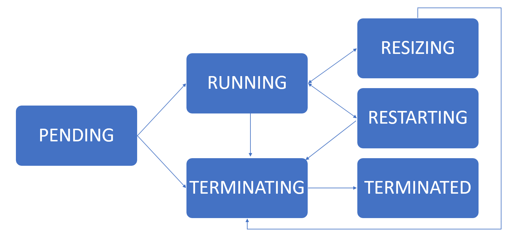

# Clusters API

## Using the utility function

The function `createDatabricksCluster` will create a Databricks&reg; cluster.
It relies on the `databricks.Cluster` class, and its
methods and helper functions. It is an easy way to create a cluster,
and it offers a few options. If there is a need for more fine grained
control of the cluster creation options, please use the underlying
class and its APIs directly, as described in the next sections.

Arguments:

```text
             name : The name of the cluster.

       numWorkers : The number of workers in the cluster. This can be a
                    single number or an array of lower and upper bound,
                    e.g. for a cluster between 2 and 10 workers the value
                    should be [2, 10]. If 0 is used then a single node cluster
                    will be created, as distinct from a cluster of size 1.

        useMATLAB : Optional argument to install MATLAB runtime on the
                    cluster. Default is true. If a Docker Image URL is
                    provided this option is ignored.

           create : Optional argument to set to true if the cluster should
                    be created immediately. If set to false, the function
                    will only return an object that can be used for
                    creating a cluster. This is useful for creating Spark
                    jobs. Default is true.

   dockerAuthFile : The name of a file containing docker information,
                    image URL, user name, and password. This can be
                    used to easily use docker settings when creating a
                    cluster. The filename can be an absolute path or
                    relative path. Currently, only no password or
                    basic_auth is supported.
                    The "spark_version" field is optional, but is
                    helpful for determining spark_version. It's
                    required if the image tag doesn't reflect the
                    Databricks runtime version.

                     {
                       "url": "some.repo.com/matlab/databricks/desktop:r2025a-dbx15.4",
                       "basic_auth": {
                         "username": "b304<REDACTED>40",
                         "password": "ol_8<REDACTED>qr"
                       },
                       "spark_version": "15.4.x-scala2.12"
                     }

                    If the repository doesn't need authentication, the
                    file may consist of only the url.

        dockerURL : Optional argument to specify the URL of a Docker Image.
                    When using Docker the spark conf
                    spark.databricks.unityCatalog.volumes.enabled
                    property will be set to "true".

   dockerUsername : Optional argument to specify the docker registry username.

   dockerPassword : Optional argument to specify the docker registry password.

     sparkVersion : Set this to set a given spark_version otherwise
                    a version based on the current default Databricks Runtime
                    will be used. This value is the Databricks Cluster API
                    spark_version field and is not strictly the version of Spark
                    used. It has the form: 15.4.x-scala2.12. The specific value
                    for a given Databricks runtime can be verified in the
                    Databricks UI.

       nodeTypeId : Set this to pick a different node type than what
                    is set in the users default settings.

   initScriptPath : Specify a non default initscript path.
                    If not specified and the default script is not present
                    the local script will be uploaded to the user's workspace.
                    % By default the initscript is stored in:
                    <settings: interfaceDirectory>/runtimes/runtime_install.sh

 interfaceDirectory : /Volumes path under which MathWorks files can be stored.

          release : MATLAB release of the form R2024a for the runtime to install.
                    By default the release of MATLAB in use is used.

      runtimePath : Specify a path to to a MATLAB runtime .zip file.
                    /Volumes, DBFS and http paths are supported.

       policyName : Set the name of the cluster policy used to create the cluster.

         policyId : Set the ID of the cluster policy used to create the cluster.

               ML : Selects a Databricks Runtime version with ML functionality
                    enabled.

              GPU : Selects a Databricks Runtime version with GPU functionality
                    enabled.

           photon : Selects a Databricks Runtime version with Photon functionality
                    enabled.

       accessMode : Data security mode decides what data governance model to
                    use when accessing data from a cluster.
                    Default: databricks.datastructures.DataSecurityMode.SINGLE_USER

      sparkConfig : Additional Spark Conf pair settings to apply to a cluster
                    e.g. databricks.SparkConfPair({'mykey', 'myvalue'})

     sparkEnvPair : Additional environment variable(s) to apply to a cluster
                    e.g. databricks.SparkEnvPair('MyVariable','MyValue')
                    To set multiple values:
                    databricks.SparkEnvPair({'SPARK_WORKER_MEMORY','28000m';'SPARK_LOCAL_DIRS','/local_disk0'})

       clusterTag : Additional ClusterTags to apply to a cluster
                    e.g. databricks.ClusterTag('myKey', 'myValue');

 autoterminationMinutes : Specifies the number of minutes of idle time after
                          which the cluster will be stopped.

       authMethod : A matlab.databricks.AuthMethod.

      profileName : A configuration file profileName value.

    enableLogging : Enables logging of the initscript and other steps.
                    The default is false.

           logDir : The location to which logs are written, the default is:
                    dbfs:/cluster-logs
                    If using /Volumes (Public Preview) additional restrictions
                    apply. See: https://docs.databricks.com/aws/en/compute/configure#compute-log-delivery

  updateClusterId : Update the cluster Id value stored in the default
                    or specified cluster. The default is false.

          verbose : Enable additional feedback. Default is true.
```

Examples:

```matlab
% Create a cluster with 4 workers that installs the MATLAB runtime
cl = createDatabricksCluster('my-cluster', 4);
```

```matlab
% Create a cluster definition without actually creating the cluster. This is
% useful when defining a cluster to be used in a Job.
cl = createDatabricksCluster('my-sl-cluster', 4, create = false);
```

```matlab
% Create a cluster without a MATLAB runtime installed. This cluster
% can still be used for interactively handling a Databricks session
% from within MATLAB, but no compiled MATLAB code can run on the
% cluster.
cl = createDatabricksCluster('plain-cluster', 4, useMATLAB = false);
```

For further docker related information, see also: [ContainerServices](ContainerServices.md).

```matlab
% Create a cluster based off a Docker image
cl = createDatabricksCluster('my-docker-cluster', 2, ...
    'dockerURL', 'myrepo.com/mathworks/databricksruntime:17.3-LTS-R2024b', ...
    'dockerUsername', 'myusername', ...
    'dockerPassword', 'mypassword');
```

```matlab
% Create a cluster using an init script stored on a Volume
cl = createDatabricksCluster("myVolumeCluster", 0, sparkVersion="16.4.x-scala2.12",...
    initScriptPath="/Volumes/main/default/myvolume/myDir/runtime_install.sh");
```

## Set the name of the cluster

The name of the cluster can be set using the property *cluster_name*.

```matlab
cl = databricks.Cluster;
cl.cluster_name = 'My Cluster Name';
```

## Set number of workers or autoscaling

The number of workers in the cluster can be set with one of two methods.
Either by setting the number of workers through a single scalar number
or by specifying autoscaling by providing the min/max number of workers.

If *num_workers* is the number of worker nodes that a given cluster should have.
Then the cluster will have one Spark&trade; Driver and *num_workers* Executors for a total
of *num_workers + 1* Spark nodes. Creating a *Single Node* cluster is described
below.

For example, to specify a fixed number:

```matlab
cl = databricks.Cluster();
cl.setNumWorkers(25);
```

To specify autoscaling:

```matlab
cl = databricks.Cluster();
cl.setNumWorkers([2 10]);
```

## Configure a Docker Image

As an alternative to providing an init script to configure cluster nodes a Docker&reg;
image URL may also be configured, using the Cluster API this is done using `setDockerImage`.

Using string/character vector arguments:

```matlab
cl = databricks.Cluster;
cl.setDockerImage('http://mydockerrepourl.example.com', 'myusername', 'mypassword');
```

Using data structures as can be used with REST API return values for example:

```matlab
cl = databricks.Cluster;
dbCredentials.username = "myusername";
dbCredentials.password = "mypassword";
dbAuth = databricks.datastructures.DockerBasicAuth(dbCredentials);
dockerSettings.url = "http://mydockerrepourl.example.com";
dockerSettings.basic_auth = dbAuth;
  
dockerImage = databricks.datastructures.DockerImage(dockerSettings);
cl.setDockerImage(dockerImage);
```

Note, it is not good practice to include passwords in source code, please
consider reading the value from a file or other external source in real
world code.

## Set a policy id

A cluster policy applies rules to the creation of clusters. Only admin users can
create, edit, and delete policies. The policy rules limit the attributes or
attribute values available for cluster creation. Setting the *policy_id* for a
cluster indicates which policy should be used to validate its creation.

```matlab
cl = databricks.Cluster();
cl.setPolicyId('ABCD000000000000');
```

If a *policy_id* value pair is specified in the *databricks-settings.json* file
it will be applied to Cluster objects by default. This can be helpful if a given
policy is always required e.g. for members of a given department.

## List available Spark Versions

Return the list of available Spark versions. These versions can be used when
launching a cluster.

```matlab
cl = databricks.Cluster();
versions = cl.getSparkVersions

versions =
  50x2 table
                key                                               name                             
    ________________________________    _____________________________________________________________
    "10.4.x-cpu-ml-scala2.12"           "10.4 LTS ML (includes Apache Spark 3.2.1, Scala 2.12)"      
    "10.4.x-gpu-ml-scala2.12"           "10.4 LTS ML (includes Apache Spark 3.2.1, GPU, Scala 2.12)" 
    "10.4.x-photon-scala2.12"           "10.4 LTS Photon (includes Apache Spark 3.2.1, Scala 2.12)"  
    "10.4.x-scala2.12"                  "10.4 LTS (includes Apache Spark 3.2.1, Scala 2.12)"         
    "11.3.x-cpu-ml-scala2.12"           "11.3 LTS ML (includes Apache Spark 3.3.0, Scala 2.12)"      
    "11.3.x-gpu-ml-scala2.12"           "11.3 LTS ML (includes Apache Spark 3.3.0, GPU, Scala 2.12)" 
    "11.3.x-photon-scala2.12"           "11.3 LTS Photon (includes Apache Spark 3.3.0, Scala 2.12)"  
    "11.3.x-scala2.12"                  "11.3 LTS (includes Apache Spark 3.3.0, Scala 2.12)"         
    "12.2.x-cpu-ml-scala2.12"           "12.2 LTS ML (includes Apache Spark 3.3.2, Scala 2.12)"      
    "12.2.x-gpu-ml-scala2.12"           "12.2 LTS ML (includes Apache Spark 3.3.2, GPU, Scala 2.12)" 
    "12.2.x-photon-scala2.12"           "12.2 LTS Photon (includes Apache Spark 3.3.2, Scala 2.12)"  
    [TRUNCATED]
```

## List available machine (node) types

List of supported Spark node types. These node types can be used when launching
a cluster. Note that node types will differ if using AWS&reg; or Azure&reg;.

For example:

```matlab
cl = databricks.Cluster();
nodeList = cl.getNodeTypes
nodeList =
  216x22 table
         node_type_id          memory_mb     num_cores          description             instance_type_id        is_deprecated                 category                  support_ebs_volumes    support_cluster_tags    num_gpus    node_instance_type    is_hidden    support_port_forwarding    display_order    is_io_cache_enabled    node_info     photon_worker_capable    photon_driver_capable    is_encrypted_in_transit    is_graviton    require_fabric_manager    min_photon_version
    _______________________    __________    _________    _______________________    _______________________    _____________    ___________________________________    ___________________    ____________________    ________    __________________    _________    _______________________    _____________    ___________________    __________    _____________________    _____________________    _______________________    ___________    ______________________    __________________
    {'Standard_DS3_v2'    }         14336        4        {'Standard_DS3_v2'    }    {'Standard_DS3_v2'    }        false        {'General Purpose'                }           true                   true                0            1x1 struct          false               true                    0                 false           1x1 struct            true                     true                      false                false               false               {[<missing>]}   
    {'Standard_DS4_v2'    }         28672        8        {'Standard_DS4_v2'    }    {'Standard_DS4_v2'    }        false        {'General Purpose'                }           true                   true                0            1x1 struct          false               true                    0                 false           1x1 struct            true                     true                      false                false               false               {'11.3'     }   
    {'Standard_DS5_v2'    }         57344       16        {'Standard_DS5_v2'    }    {'Standard_DS5_v2'    }        false        {'General Purpose'                }           true                   true                0            1x1 struct          false               true                    0                 false           1x1 struct            true                     true                      false                false               false               {'11.3'     }   
    {'Standard_D4s_v3'    }         16384        4        {'Standard_D4s_v3'    }    {'Standard_D4s_v3'    }        false        {'General Purpose'                }           true                   true                0            1x1 struct          false               true                    0                 false           1x1 struct            true                     true                      false                false               false               {'11.3'     }   
    {'Standard_D8s_v3'    }         32768        8        {'Standard_D8s_v3'    }    {'Standard_D8s_v3'    }        false        {'General Purpose'                }           true                   true                0            1x1 struct          false               true                    0                 false           1x1 struct            true                     true                      false                false               false               {'11.3'     }   
    [TRUNCATED]
```

## Create a new Spark Cluster

Creating a new Spark cluster while acquiring new instances from the cloud provider
if necessary is possible if the user has specified the number of workers.

```matlab
% Configure a spark cluster
cl = databricks.Cluster;
cl.cluster_name = 'Sample Cluster';    % user specified name
cl.spark_version = '17.3.x-scala2.13'; % key from the getSparkVersions
cl.setNumWorkers([2 10]);              % autoscaling cluster min 2, max 10

% Create the cluster
cl.create();
```

The output of a successful creation will be the addition of a `cluster_id`
property to the cluster object.

```matlab
cl =

 Cluster with properties:

    cluster_name: 'Sample Cluster'
   spark_version: '17.3.x-scala2.13'
    node_type_id: 'i3.xlarge'
         Version: 2
       autoscale: [1x1 struct]
      cluster_id: '0531-031912-trill440'
```

The call to `create` is asynchronous; the returned `cluster_id` can
be used to poll the cluster state. When this method returns, the cluster is
in a *PENDING* state. The cluster is usable once it enters a *RUNNING* state.

The use of additional methods will configure the cluster for use with MATLAB&reg;.
Use the `enableMATLABRuntime` method to automate the installation of the
MATLAB runtime on the cluster. See [Init script configuration](InitScripts.md)
for details.

Similarly, it is possible to create and attach custom tags during the creation
of the cluster.

```matlab
tags = databricks.ClusterTag('owner','JohnSmith')
cl.setCustomTags(tags);
```

## Describe a cluster (i.e. get information about an existing cluster)

Retrieve the information for a cluster given its identifier. Clusters can be
described while they are running or up to 30 days after they are terminated.

To see all information about a cluster, please use:

```matlab
cl.refresh();
cl

cl = 
  Cluster with properties:

                    cluster_name: 'Sample Cluster'
                    node_type_id: 'Standard_D4ds_v5'
                   spark_version: '17.3.x-scala2.13'
                      spark_conf: [3x1 containers.Map]
                 instance_source: [1x1 struct]
                  spark_env_vars: [1x1 containers.Map]
          driver_instance_source: [1x1 struct]
         autotermination_minutes: 120
         effective_spark_version: '17.3.x-scala2.13'
                   state_message: ''
                      start_time: 17-Sep-2025 17:17:29
             driver_node_type_id: 'Standard_D4ds_v5'
                      cluster_id: '0917-171729-smm2fzjo'
                 terminated_time: 18-Sep-2025 00:34:49
            last_state_loss_time: 17-Sep-2025 22:31:58
                           state: 'RUNNING'
              last_activity_time: 17-Sep-2025 22:31:04
                     custom_tags: [1x1 struct]
             last_restarted_time: 17-Sep-2025 22:31:58
             enable_elastic_disk: 1
                    default_tags: [1x1 struct]
                  cluster_source: 'UI'
              termination_reason: [1x1 struct]
               creator_user_name: 'joe@example.com'
    enable_local_disk_encryption: 0
          init_scripts_safe_mode: 0
                spark_context_id: 4393639146836003594
                  driver_healthy: 1
                  runtime_engine: 'STANDARD'
                azure_attributes: [1x1 struct]
                     num_workers: 0
              data_security_mode: 'SINGLE_USER'
                       disk_spec: [1x1 struct]
                single_user_name: 'joe@example.com'
```

The `state` property provides information of the state of the cluster.

| State      | Description |
|------------|-------------|
|PENDING     |Indicates that a cluster is in the process of being created. |
|RUNNING     |Indicates that a cluster has been started and is ready for use. |
|RESTARTING  |Indicates that a cluster is in the process of restarting. |
|RESIZING    |Indicates that a cluster is in the process of adding or removing nodes.|
|TERMINATING |Indicates that a cluster is in the process of being destroyed.|
|TERMINATED  |Indicates that a cluster has been successfully destroyed.|
|ERROR       |This state is not used anymore. It was used to indicate a cluster that failed to be created. Terminating and Terminated are used instead.|
|UNKNOWN     |Indicates that a cluster is in an unknown state. A cluster should never be in this state.|



## Starting a terminated cluster

Start a terminated Spark cluster given its ID.

* The previous cluster ID and attributes are preserved.
* The cluster starts with the last specified cluster size. If the previous cluster was an autoscaling cluster, the current cluster starts with the minimum number of nodes.
* If the cluster is not in a `TERMINATED` state, nothing will happen.

Clusters launched to run a job cannot be started.

To start a stopped cluster:

```matlab
cl.start();
```

## Terminating a cluster

It is possible to terminate a cluster using its `cluster_id`. The cluster
is removed asynchronously. Once the termination has completed, the cluster will
be in a `TERMINATED` state. If the cluster is already in a `TERMINATING` or
`TERMINATED` state, nothing will happen.

30 days after a cluster is terminated, it is permanently deleted.

To terminate a cluster:

```matlab
cl = databricks.Cluster;
cl.setClusterId('0531-031912-trill440');
cl.terminate();
```

## Permanently deleting a cluster

When permanently deleting a running cluster it is terminated and
its resources are asynchronously removed. If the cluster is terminated, then
it is immediately removed.

You cannot perform any action on a permanently deleted cluster.
Such a cluster is also no longer returned in the cluster list.

To permanently delete a cluster.

```matlab
cl.permanentDelete();
```

## List available clusters

To connect to an existing cluster, it is possible to list available Databricks clusters.

```matlab
clusterList = databricks.Cluster.list();
```

If the cluster_id is known, it is possible to directly connect to an existing cluster.

```matlab
cl = databricks.Cluster;
cl.setClusterId('0531-031912-trill440');
cl.refresh();
```

## Configuring initialization scripts

Use the `enableMATLABRuntime` method to automate the installation of the
MATLAB runtime on the cluster. See [Init script configuration](InitScripts.md)
for details. In general call when creating a cluster:

```matlab
cl.enableMATLABRuntime('enableInitLogging', true);
```

This enables the installation of the runtime and logging. The default logging
directory is `dbfs:/logs/cluster_logs`. Logging is optional and the destination
can also be configured using `enableMATLABRuntime`.

## Configuring log delivery location

When a cluster is created it is possible to specify a location to deliver Spark
driver, worker, and event logs. The location is in part based on the cluster ID.
This can be useful for viewing init script logs. The base location is specified
prior to creating a cluster as follows:

```matlab
conf = databricks.ClusterLogConf;
conf.setDestination('dbfs:/logs/cluster_logs');
cl.setClusterLogConf(conf);
```

In this case the runtime was not in place so the init script failed. Init script
logs are stored in a subdirectory of the specified location named in the following
format (default):
`dbfs:/cluster-logs/init_scripts/<cluster_id>_<container_ip>`
Standard out and standard error are stored in separate files.

## Listing events from a cluster

Retrieving a list of events about the activity of a cluster is possible as follows:

```matlab
db = databricks.Cluster;
db.setClusterId('0306-145113-sw6tbqnb');
ev = db.getEvents();
ev =
  8x3 timetable
         timestamp                 cluster_id                  type             details   
    ____________________    ________________________    __________________    ____________
    06-Mar-2026 18:03:02    {'0306-145113-sw6tbqnb'}    {'TERMINATING'   }    {1×1 struct}
    06-Mar-2026 16:58:03    {'0306-145113-sw6tbqnb'}    {'DRIVER_HEALTHY'}    {1×1 struct}
    06-Mar-2026 16:57:29    {'0306-145113-sw6tbqnb'}    {'RUNNING'       }    {1×1 struct}
    06-Mar-2026 16:54:41    {'0306-145113-sw6tbqnb'}    {'STARTING'      }    {1×1 struct}
    06-Mar-2026 16:53:49    {'0306-145113-sw6tbqnb'}    {'TERMINATING'   }    {1×1 struct}
    06-Mar-2026 15:03:04    {'0306-145113-sw6tbqnb'}    {'DRIVER_HEALTHY'}    {1×1 struct}
    06-Mar-2026 15:02:46    {'0306-145113-sw6tbqnb'}    {'RUNNING'       }    {1×1 struct}
    06-Mar-2026 14:51:14    {'0306-145113-sw6tbqnb'}    {'CREATING'      }    {1×1 struct}
```

## Creating a Single Node cluster

A single node cluster combines the role of a driver node and worker node on a
single node, rather than having a separate driver and worker nodes. This can be
useful for reducing execution costs for small scale workloads e.g. during testing
or development or when running an application like desktop MATLAB which typically
runs on a single system.

The process for starting a single node cluster is similar to that of a regular
cluster as previously described with the addition of configuring a `ClusterTag`
and a `SparkConfPair` as shown. The number of workers should be set to 0,
the driver node will fullfil the role of the worker also.

```matlab
cl = databricks.Cluster;
cl.cluster_name = 'mySingleNodeClusterName';
cl.spark_version ='17.3.x-scala2.13';

% Configure a tag to denote a single node cluster
tagSingleNode = {'ResourceClass','SingleNode'};
tags = databricks.ClusterTag(tagSingleNode);
cl.setCustomTags(tags);

% Configure a SparkConfPair to denote a single node cluster
scpSingleNode = {'spark.master','local[*,4]';'spark.databricks.cluster.profile','singleNode'};
scps = databricks.SparkConfPair(scpSingleNode);
cl.setSparkConf(scps);

% Set number of workers to 0
cl.setNumWorkers(0);

% Configure other properties as required and start the cluster as normal
cl.enableMATLABRuntime('enableInitLogging', true, 'enableRuntimeInstall', true);
cl.create();
```

Alternatively a convenience method `setSingleNode()` is provided to set
the required number of workers, custom tag and Spark Conf pair in a single operation.

```matlab
cl = databricks.Cluster;
cl.cluster_name = 'mySingleNodeClusterName';
cl.spark_version ='17.3.x-scala2.13';

% Configure a single node cluster
cl.setSingleNode();

% Configure other properties as required and start the cluster as normal
cl.enableMATLABRuntime('enableInitLogging', true, 'enableRuntimeInstall', true);
cl.create();
```

## Standard (Shared/USER_ISOLATION) clusters

There are a number of compatibility and capability considerations that arise when
creating Standard (formerly USER_ISOLATION/Shared) clusters. This is discussed in
detail in: [User Isolation clusters](Isolation.md). MATLAB is not supported on
Dedicated clusters and not Standard clusters.

## MW_RUNTIME_RELEASE

If creating a MATLAB runtime enabled cluster setting a Spark environment variable
`MW_RUNTIME_RELEASE` to indicate the MATLAB Runtime release used is recommended.
The `enableMATLABRuntime` method does this automatically.

```matlab
SEP = databricks.SparkEnvPair({"MW_RUNTIME_RELEASE", "R2025b"});
cl.setSparkEnvVars(SEP);
```

This can be queried using `release = matlab.databricks.cluster.getClusterMATLABRelease(cluster=clusterId)`.

## Enabling the MATLAB Runtime on an existing cluster

The `databricks.Cluster.edit()` method can be used to update the configuration of
an existing cluster. To simplify applying all of the required updates to use the
MATLAB runtime the function `matlab.databricks.cluster.MATLABEnableExistingCluster()`
is provided and supports limited configurability.
Editing a cluster requires that it be restarted. Clusters can also be edited via
the Databricks GUI which can be more convenient for occasional use.

Example:

```matlab
existingCluster = databricks.Cluster.findById("0708-093802-38njgrhw");
% Or use findByName()
updatedCluster = matlab.databricks.cluster.MATLABEnableExistingCluster(existingCluster);
```

## References

1. For more details see [https://docs.databricks.com/api/latest/clusters.html](https://docs.databricks.com/api/latest/clusters.html)

[//]: #  (Copyright 2020-2026 The MathWorks, Inc.)
