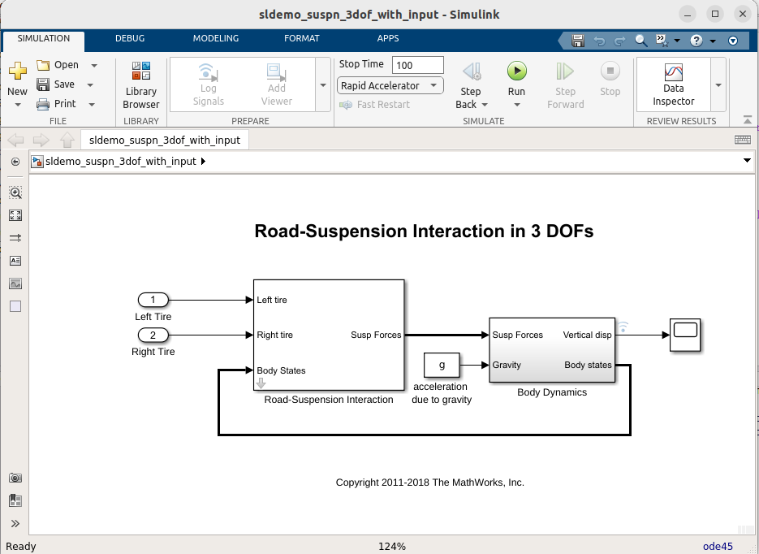
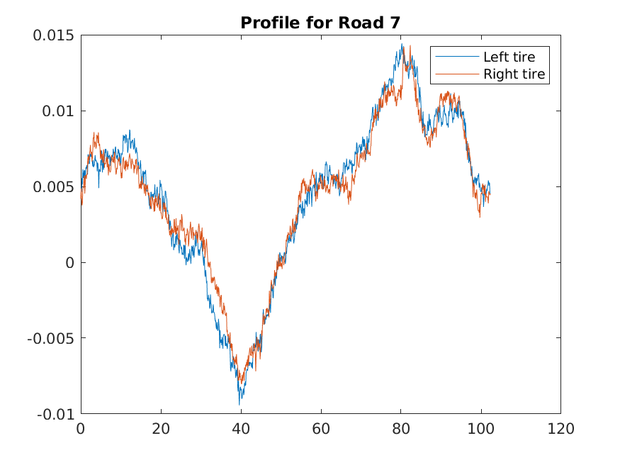

# Executing Simulink models with data on Databricks

A Simulink model can be run as part of a Spark&trade;/Databricks&reg; pipeline, allowing
the user to simulate a mode with Spark functions,
(e.g. `DF.applyInPandas(mySimulinkFunction,...)`).

> **Note** Simulink&reg; Compiler&trade; output is platform dependent, and Databricks runs on Linux&reg;.
> Therefore the model must be compiled on a Linux system.
> If a model is compiled on Windows&reg; and deployed to Databricks, an
> error message similar to the following will appear:
> ```
> Application not supported on Linux due to platform dependencies. Intended
> platforms include: Windows.
> For more information, please contact the application author.
> ```
> Furthermore, some versions of Linux may not interoperate with Databricks
> due to `glibc` version differences.
> Databricks versions 13.3, 14.3 and 15.4 all use Ubuntu&reg; 22.04
> Using compilation systems with the same or compatible `glibc` versions is important
> for compatibility, so in the current version, using Ubuntu 22.04 is a good choice.

## Deploying a Simulink model with PythonSparkBuilder

This demo uses `sldemo_suspn_3dof_with_input` model, an adapted version of the
demo included with Simulink, `sldemo_suspn_3dof`. This model has been adapted to take the
road profiles as inputs, instead of from a MAT-file.

The demo files can be found in the installed package, here:

`<databricks>/Software/MATLAB/examples/SimulinkSuspension3DoF`



### Run the model on the desktop

To prepare for running this model, the original data is used, and saved
as separate *Parquet* files, one for each road profile.
Simply run the function `createDataSets`. This will create a local folder
`data`, with the parquet files.

To run the model locally, do as follows:

```matlabsession
% Read one of the Parquet files
>> T = parquetread('data/Road1.parquet')
T =
  1024x4 table
    Time     LeftTire     RightTire      ID   
    _____    _________    _________    _______
        0    0.0047321    0.0052805    "Road1"
      0.1    0.0046744    0.0050971    "Road1"
      0.2    0.0046441    0.0050645    "Road1"
      :          :            :           :   
    102.2    0.0047724    0.0053879    "Road1"
    102.3     0.004722    0.0053297    "Road1"
  Display all 1024 rows.

% Run the simulation with this table data
>> output = runModel_spark_with_input(T, 1400)
output =
  1024x5 table
    Time     LeftTire     RightTire      ID       VerticalDisplacement
    _____    _________    _________    _______    ____________________
        0    0.0047321    0.0052805    "Road1"                 0      
      0.1    0.0046744    0.0050971    "Road1"         0.0013436      
      0.2    0.0046441    0.0050645    "Road1"         0.0055904      
      :          :            :           :                :          
    102.2    0.0047724    0.0053879    "Road1"               NaN      
    102.3     0.004722    0.0053297    "Road1"               NaN      
  Display all 1024 rows.
```

In order to run this in a Databricks context, we need to do a few things.

### Upload the data

If the compiled model should run on Databricks, the data must be there too.
This can be achieved by running the function `uploadDatasets(<destinationDirectory>)`. This assumes
access is setup correctly, and that the user has write permissions on DBFS.

```matlabsession
>> uploadDatasets("/Volumes/main/default/myvolume/Examples/suspn_3dof/")
Uploading to: /Volumes/main/default/myvolume/Examples/suspn_3dof/Road1.parquet
Uploading to: /Volumes/main/default/myvolume/Examples/suspn_3dof/Road10.parquet
Uploading to: /Volumes/main/default/myvolume/Examples/suspn_3dof/Road11.parquet
  .
  .
  .
```

### Compiling the function

To compile the function, there is a build function present in the folder,
`buildLibrary`.

If the configuration is setup correctly, with `cluster_id` in
the file `.databrickscfg` is pointing to a running cluster, the created
wheel file can be uploaded to Volumes and installed on that cluster automatically
by calling `buildLibrary` with Name-Value pair `'destinationDirectory', '/Volumes/a/valid/location/where/to/upload/it'`.

If this is not possible or desired, the wheel file can also be installed on a cluster
with the usual methods through Databricks Portal.

```matlabsession
>> buildLibrary('destinationDirectory','/Volumes/main/default/myvolume/Examples/suspn_3dof/model')
Output directory: /tmp/tpd0220066_098c_4a54_82b4_6230c9e12398/_build
Destination directory: /Volumes/main/default/myvolume/Examples/suspn_3dof/model
### Using schema for datatype info for function runModel_spark_with_input.
### Testing runModel_spark_with_input: inputNames, outputNames, colsIterator, mapPartitions, pandasToColumns, columnsToPandas, applyInPandas, mapInPandas
	### Found one, running mapPartitions_PythonMATLABHelper generation for runModel_spark_with_input
	### Found one, running applyInPandas_PythonMATLABHelper generation for runModel_spark_with_input
### Searching for referenced models in model 'sldemo_suspn_3dof_with_input'.
### Total of 1 models to build.
### Building the rapid accelerator target for model: sldemo_suspn_3dof_with_input
### Successfully built the rapid accelerator target for model: sldemo_suspn_3dof_with_input
DEMO Compiler license. 
  The generated application will expire 30 days from today, 
  on Sat Jul 18 14:07:24 2026.
Created .whl file: /local_disk0/maben/matlab-interface-for-databricks/matlab-databricks/Software/MATLAB/examples/SimulinkSuspension3DoF/_build/dist/demo.suspn3dof_with_input-26.1.0-py3-none-any.whl
Scanning for incompatible binaries.
Generating examples for runModel_spark_with_input ...
Uploading: demo.suspn3dof_with_input-26.1.0-py3-none-any.whl to: /Volumes/main/default/myvolume/Examples/suspn_3dof/model ...
Installing wheel on cluster: 0618-071916-s3tngo13
Library installation requested

ans = 

  PythonSparkBuilder with properties:

        BuildResults: [1×1 compiler.build.Results]
           BuildOpts: [1×1 compiler.build.PythonPackageOptions]
             PkgName: "demo.suspn3dof_with_input"
           PkgFolder: []
           OutputDir: '/local_disk0/maben/matlab-interface-for-databricks/matlab-databricks/Software/MATLAB/examples/SimulinkSuspension3DoF/_build'
              SrcDir: "/local_disk0/maben/matlab-interface-for-databricks/matlab-databricks/Software/MATLAB/examples/SimulinkSuspension3DoF/_build/demo/suspn3dof_with_input"
               Files: [1×1 compiler.build.spark.PythonFileV2]
        GenMatlabDir: "/local_disk0/maben/matlab-interface-for-databricks/matlab-databricks/Software/MATLAB/examples/SimulinkSuspension3DoF/_build/matlab_helpers"
         HelperFiles: [1×2 string]
        ExampleFiles: [1×2 table]
     ZipArtifactName: "/local_disk0/maben/matlab-interface-for-databricks/matlab-databricks/Software/MATLAB/examples/SimulinkSuspension3DoF/_build/demo.suspn3dof_with_input_Artifact.zip"
    WheelDestination: [0×0 string]
```

### Running the model/function in a Databricks notebook

In the example folder, a Python&reg; notebook is present, `3DoF-Profiles.py`.
This can be imported into the Databricks Workspace, opened, attached to the
cluster where the wheel file is installed, and run.

The notebook will group the dataset by Id, and use the `applyInPandas` method to
run the simulation for different profiles, save the data on Databricks (in *Delta* format),
and display a part of the results.

As a comparison, after this has run, the results can also be read and visualized
in MATLAB&reg;. This can be done as follows (the source folder will differ):

```matlabsession
>> spark = getDefaultDatabricksSession
spark = 
  SparkSession with properties:

    SparkServer: 'local'
        AppName: 'matlab_20220908T143357'

>> DS_3DoF = spark.read.format("delta").load("/example/3dof_out/profiles_20241108_085751")
DS_3DoF = 
  Dataset with no properties.

>> Profile7 = DS_3DoF.filter("ID LIKE 'Road7'").table()
Profile7 =
  1024x5 table
    Time     LeftTire     RightTire      ID       VerticalDisplacement
    _____    _________    _________    _______    ____________________
        0    0.0046621    0.0042013    "Road7"                  0     
      0.1    0.0046777     0.004857    "Road7"          0.0012668     
      0.2    0.0046217    0.0041132    "Road7"          0.0053521     
      0.3    0.0055514    0.0037509    "Road7"           0.009002     
      0.4    0.0051312    0.0038643    "Road7"          0.0080492     
      0.5    0.0061338    0.0047569    "Road7"          0.0021835     
      0.6    0.0055649    0.0049687    "Road7"         -0.0044923     
      :          :            :           :                :          
    102.1    0.0052487    0.0045104    "Road7"                NaN     
    102.2    0.0045861    0.0044263    "Road7"                NaN     
    102.3    0.0045008     0.004534    "Road7"                NaN     
  Display all 1024 rows.

>> plot(Profile7.Time, [Profile7.LeftTire, Profile7.RightTire])
>> legend('Left tire', 'Right tire')
>> title('Profile for Road 7')
```



## References

Please see:

* [https://www.mathworks.com/products/simulink-compiler.html](https://www.mathworks.com/products/simulink-compiler.html)

[//]: #  (Copyright 2020-2024 The MathWorks, Inc.)
