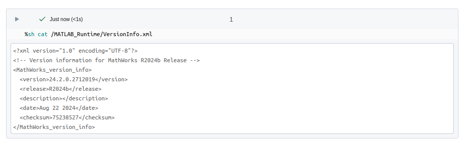

# Init script customization

> From v6.0.0 the use of init scripts is deprecated and Docker&reg; is now the preferred,
> and in some cases required, way to deploy the MATLAB&reg; runtime to a databricks cluster.
> See: [Container Services](ContainerServices.md) & [https://github.com/mathworks-ref-arch/matlab-on-databricks/tree/main/resources/dockerfiles/runtime](https://github.com/mathworks-ref-arch/matlab-on-databricks/tree/main/resources/dockerfiles/runtime)

*A future release will remove support for init scripts.*

## When must Docker be used? / When can init scripts not be used?

From version 7.0.0 init scripts cannot be used on clusters without internet access
and docker images must be used.

For Databricks&reg; Runtime 17.x and later Docker images must be used.

## Setup

A template init script file can be found here: `Software/MATLAB/script/runtime_install.sh`.
At setup put the init script in the `*interface directory*/runtimes/`
directory e.g. `/Volumes/main/default/myvolume/MathWorks/runtimes/runtime_install.sh`.

Init scripts can still be stored in Workspaces, however Databricks recommends using
`/Volumes`. An init script is a bash script.

## Init script configuration, used if Docker is not an option

If working from within MATLAB `createDatabricksCluster()` can be used to configure
init scripts for a `databricks.Cluster` object.

> useMATLAB=true currently uses init scripts, this will change in the future
> to adopt a docker based approach by default.

```matlab
cl = createDatabricksCluster("myClusterName", 2, useMATLAB=true, updateClusterId=true);
```

The `enableLogging=true` argument enables logging. From v5.0.0 the default
logging directory is `dbfs:/cluster-logs`. Logging is optional.
`/Volumes` paths are also supported with some restrictions and recommended.

## Manual init script configuration

This is generally not necessary.
An init script can be uploaded to a Workspace manually as follows:

```matlab
ws = databricks.Workspace;
% If a directory does not exist provide one, default shown
ws.mkdirs('/Users/username@example.com/MathWorks/<version>/runtime/')
ws.import('path', '/Users/username@example.com/MathWorks/<version>/runtime/runtime_install_custom.sh',...
          'format', 'AUTO',...
          'file', '/mylocaldir/runtime_install_custom.sh',...
          'overwrite', true)
```

Use the Files API to upload to `/Volumes`.

To trigger the installation of the runtime on initialization, this script is
attached to the `init_script` request parameter of the cluster object.

> Init scripts run on Linux&reg;, therefore the line endings are pertinent.
> Failure to use the proper line endings (LF) instead of (CRLF) will result in the
> init script failing. This is particularly important if the script is being edited
> on a Windows&reg; machine.

The init scripts are be automatically executed at cluster creation time. When a
cluster with an InitScriptInfo object is created, Databricks will run the commands
in the initialization script. The status of the initialization scripts can be
seen in the event log for the cluster. For the detailed output of the scripts
themselves configure a log delivery location. For example:

```matlab
% Create a new cluster and handle to DBFS
ws = databricks.Workspace;
cl = databricks.Cluster;

% Specify an init script
is = databricks.InitScriptInfo;
wsi = databricks.datastructures.WorkspaceStorageInfo('/Users/username@example.com/MathWorks/<version>/runtime/runtime_install_custom.sh');
is.setDestination(wsi);

% Check if the file exists
status = ws.getStatus('/Users/username@example.com/MathWorks/<version>/runtime/runtime_install_custom.sh');

% Configure it
cl.cluster_name = ['TestCluster', datestr(now)];
cl.setNumWorkers([2 10]);
cl.setInitScriptInfo(is);

% Create a cluster
cl.create();
```

## Validation of the runtime installation

A completed installation can be checked from a notebook. To do so, attach a notebook
to the cluster and use the *language magic command* feature of the notebook to query the runtime state.

For example:

```bash
%sh cat /MATLAB_Runtime/VersionInfo.xml
```



## Using Custom Container services

The MATLAB Runtime can be installed using the custom container services, see [Docker Runtimes](Docker Runtimes.md).

## MW_RUNTIME_RELEASE

If creating a custom cluster setting a Spark&trade; environment variable `MW_RUNTIME_RELEASE` to indicate the MATLAB Runtime release version supported by a give cluster is recommended. The `enableMATLABRuntime` method does this automatically.

```matlab
SEP = databricks.SparkEnvPair({"MW_RUNTIME_RELEASE", "R2024b"});
cl.setSparkEnvVars(SEP);
```

This can be queried using `release = matlab.databricks.cluster.getClusterMATLABRelease(clusterId)`.

## References

* [https://docs.databricks.com/en/_extras/documents/aws-init-volumes.pdf](https://docs.databricks.com/en/_extras/documents/aws-init-volumes.pdf)

[//]: #  (Copyright 2021-2026 The MathWorks, Inc.)
