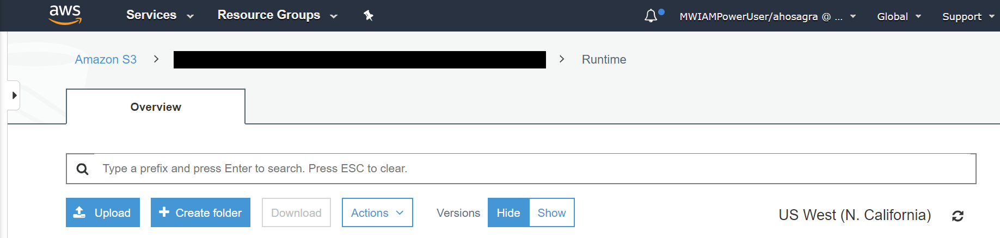
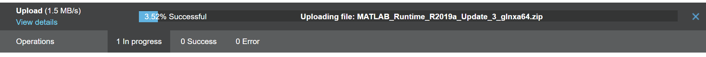

# Installing the MATLAB Runtime

## Setup

For details of provisioning the MATLAB runtime on Databricks&reg; clusters see the
[MATLAB on Databricks Reference Architecture](https://github.com/mathworks-ref-arch/matlab-on-databricks).
This is the recommended approach for provisioning the MATLAB runtime and uses docker.

This applies both if the cluster is created via a policy or the `createDatabricksCluster`
MATLAB command. However if desired the following describes alternative manual
configuration approaches can be considered.

>For clusters using Databricks runtime v17 or greater, docker must be used.

## Custom setup

If executing MATLAB code that has been compiled (using MATLAB&reg; Compiler SDK&trade;) to `.whl`
format on a Databricks cluster, the cluster must be provisioned with the
version of the MATLAB runtime corresponding to the version of MATLAB used for the
compilation step. The MATLAB runtime can be configured using init scripts or by using
a docker container that includes the runtime, see:
[Docker&reg; runtimes for MATLAB and Databricks](ContainerServices.md) and [Clusters](ClusterAPI.md).

Typically MATLAB runtimes are stored in `.zip` form on `/Volumes`, the default
directory being `MathWorks/runtime`. At cluster creation time the runtime is
copied to the cluster nodes, decompressed and installed via an init script.
A local copy of the init script is included in the package and can be found in
`Software/MATLAB/script/runtime_install.sh`. See: [Init Scripts](InitScripts.md).

If more than one version of MATLAB is being used at the client side then multiple
corresponding runtimes should be put in place on the server side. However, only
one runtime version is supported on a cluster at any one time.

The MATLAB runtimes can be freely downloaded from: [https://www.mathworks.com/products/compiler/matlab-runtime.html](https://www.mathworks.com/products/compiler/matlab-runtime.html).

> Databricks nodes always use Linux&reg;, thus *only* the Linux version of the MATLAB
> runtime should be used.

> The MATLAB runtime is *not* required to use Databricks Connect (unless using UDFs),
> JDBC/ODBC or the Databricks REST API interfaces.

The runtime setup step from the setup process can be invoked directly by calling:
`matlab.databricks.setup.configureRuntimes()` or by calling `Software/MATLAB/setup.m`
and skipping the unrelated sections. This will generate `wget` shell commands to
download the runtime directly to `/Volumes` using a `%sh` cell in a notebook.
They also provide the deep link directly to the `runtimes` directory in the portal.

There are several ways to put the runtime in place:

* Notebook based download
* Portal based upload.
* Uploads to cloud object stores e.g.: AWS&reg; S3 or Azure&reg; Blob Storage.

Upload via the Files and particularly DBFS APIs are slower and or less reliable.

> If a non default runtime location is used, e.g. S3 or ABFSS/Blob, this
> must then be specified as an argument when creating a cluster and should be
> configured in any policies in use. Using `/Volumes` is strongly recommended.

Runtime download URLs are configured in the `Software/MATLAB/config/package-settings.json`
file. End user updates to this file should not normally be required.

## Offline cluster requirements

For offline clusters (clusters without internet access), the MATLAB requires 2 essential
dependencies `libgbm1` and `libnss3`, which are needed for Simulink&reg; Compiler&trade; output.
The corresponding `.deb` files returned by apt-get should be stored in a `/deps/`
subdirectory of the directory containing the runtime.zip file.

> Using docker removes this complexity by bundling all dependencies within the container image.

## Enabling the MATLAB Runtime on a Databricks Cluster

Once the MATLAB Runtime .zip file is in place on Databricks it needs to enabled on
newly created clusters. By default and when not using docker images this is done
using so called init scripts, this is described in detail in [Init Scripts](InitScripts.md).

### Using the AWS Simple Storage Service (S3)

Navigate to an appropriate folder (e.g.: ```/MathWorks/runtime/```) on AWS S3. Upload the
runtime image manually either using the web UI or via an appropriate CLI command.

Web UI:


On successful upload, the installer will be available at the specified location
for use with the installer script.



CLI:

```bash
aws s3 cp ./MATLAB_Runtime_R2025b_glnxa64.zip s3://[REDACTED]/runtime/
```

### Using the MATLAB Interface to AWS S3

To upload the runtime from with MATLAB directly to an S3 location see:
[https://www.mathworks.com/help/matlab/import_export/work-with-remote-data.html](https://mathworks.com/help/matlab/import_export/work-with-remote-data.html)
for configuration details:

```matlab
setenv('AWS_ACCESS_KEY_ID', 'YOUR_AWS_ACCESS_KEY_ID'); 
setenv('AWS_SECRET_ACCESS_KEY', 'YOUR_AWS_SECRET_ACCESS_KEY');
copyfile('c:\localDir\MATLAB_Runtime_R2025b_glnxa64.zip', 's3://mybucketname/runtimes/');
```

### Using Azure Blob storage

The runtime can e stored in blob storage and a `HTTPS` Shared Access Signature (SAS) URL
can be generated and used for runtime downloads.

[//]: #  (Copyright 2020-2026 The MathWorks, Inc.)
