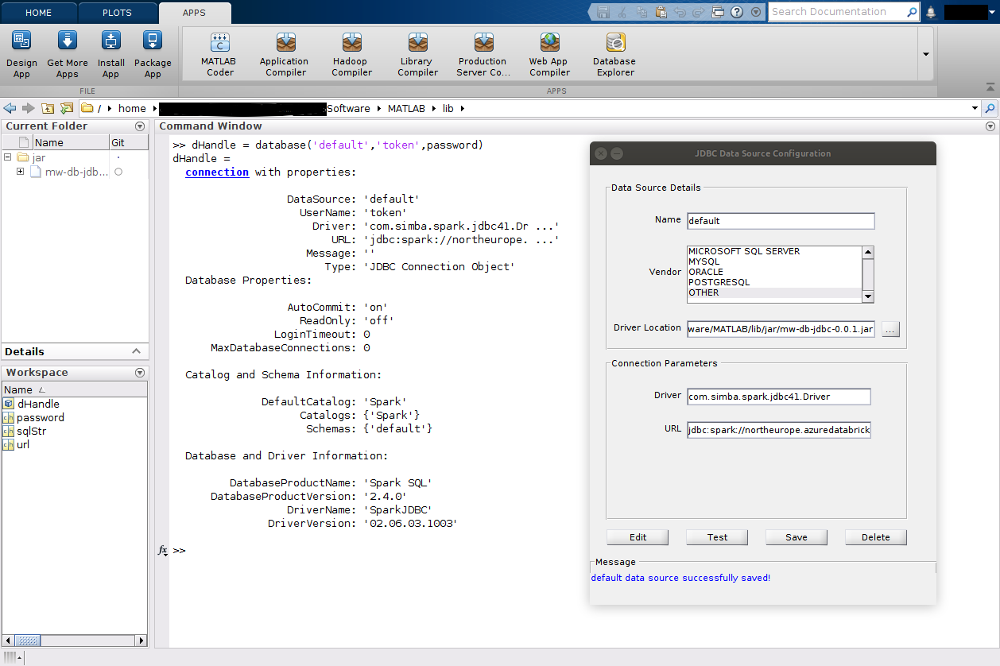

# JDBC and Database Toolbox workflow

This workflow requires a Databricks&reg; JDBC driver which must be downloaded from
[Databricks](https://www.databricks.com/spark/jdbc-drivers-archive). The `jarFilePath`
name-value pair can be used to specify the path to the driver.
See [Installing JDBC Driver](InstallingJDBCDriver.md) for download and Java version
compatibility details.
The driver must be on the MATLAB&reg; dynamic Java&reg; class path to be used.
The creation of a `databricks.JDBCConnection` object adds the driver to the path
ordinarily.

The package supports both Databricks JDBC drivers:

* Versions >= 2.7.3 and < 3.0.0 (the non-OSS Simba based driver).
* Versions 3.0.3 and newer (the OSS driver).

The OSS driver requires that MATLAB uses a Java environment of v11 or greater,
see: [Installing JDBC Driver](InstallingJDBCDriver.md).

> Apart from using a *JDBC* driver to connect to Databricks through Database Toolbox&trade;,
> it is also possible to connect through [Database Toolbox and an ODBC driver](ODBCWorkflow.md).

## Connect to Databricks using Database Toolbox

[Database Toolbox](https://www.mathworks.com/products/database.html) provides both
GUI and programmatic interfaces for configuring connections to databases. In this
section both approaches are described, in general the programmatic approach is used
however the GUI based approach can be useful for testing and debugging.

Further, Databricks offers two ways of connecting over JDBC:

1. To a specific cluster.
2. To a SQL Warehouse.

Refer to the [SQL Warehouses API documentation](SQLWarehousesAPI.md) for more
information on how to connect to a SQL warehouse.

### Creating a connection programmatically

The `databricks.JDBCConnection` class is used to create a configured JDBC Database
Connection object. The `JDBCdatabase.jdbc.connection` object is stored in the
`JDBCConnection.Connection` property. By default the class will use the same
authentication method used by the REST API interfaces, see [Authentication.md](Authentication.md).

The following named arguments can be used to override the values
obtained from settings & configuration files and defaults when creating a
`databricks.JDBCConnection` object.

### Optional named argument types and defaults

| Name                    | Type    | Default                             |
| ----------------------- | ------- |------------------------------------ |
| driverClass             | string  | "com.databricks.client.jdbc.Driver" |
| jarFilePath             | string  | Depends on drivers & Java version   |
| useDriverType           | char    | Must be either 'oss' or 'simba'     |
|                         |         |                                     |
| connectionURL           | string  |                                     |
| connectionURLAppend     | string  |                                     |
|                         |         |                                     |
| host                    | string  |                                     |
| port                    | string  | "443"                               |
|                         |         |                                     |
| schema                  | string  | "default"                           |
| catalog                 | string  |                                     |
|                         |         |                                     |
| cluster                 | databricks.Cluster/string |                   |
|                         |         |                                     |
| useDriverAuth           | logical | true                                |
| authMethod              | matlab.databricks.AuthMethod | Settings file authMethod value |
| profileName             | string  | Settings file profileName value     |
|                         |         |                                     |
| OauthService            | matlab.databricks.OauthService | matlab.databricks.OauthService.Databricks |
| oauth2ClientId          | string  | "databricks-sql-jdbc"               |
| passthroughAccessToken  | string  |                                     |
| passthroughRefreshToken | string  |                                     |
| scope                   | string  |                                     |
| TokenCachePassPhrase    | string  |                                     |
| enableTokenCache        | logical |                                     |
| cacheFilePath           | string  |                                     |
|                         |         |                                     |
| httpPath                | string  |                                     |
| ssl                     | logical | true                                |
| thriftTransport         | int32   |                                     |
| defaultStringColumnLength | int32 |                                     |
|                         |         |                                     |
| disableSourceCreation   | logical | false                               |
| dataSourceName          | string  |                                     |
|                         |         |                                     |
| logLevel                | string  | "0"                                 |
| verbose                 | logical | true                                |

### Optional named argument descriptions

| Name                    | Description                                   |
| ----------------------  | --------------------------------------------- |
| driverClass             | Class name of the JDBC driver                 |
| jarFilePath             | Path to the JDBC driver jar file              |
| useDriverType           | Used to select a specific driver type         |
|                         |                                               |
| connectionURL           | Overrides the complete  connection URL value  |
| connectionURLAppend     | Append further values to the connection URL   |
|                         |                                               |
| host                    | Databricks Workspace hostname                 |
| Port                    | Port to be used by the connection             |
|                         |                                               |
| schema                  | Name of the database/schema to use            |
| catalog                 | Set the Unity Catalog catalog                 |
|                         |                                               |
| cluster                 | databricks.Cluster or Cluster Id text value   |
|                         |                                               |
| useDriverAuth           | The driver's Oauth2 auth used by default      |
| authMethod              | Use a non default authentication method       |
| profileName             | Name of a profile in `.databrickscfg` file    |
|                         |                                               |
| OauthService            | Specify an OAuth service provider             |
| oauth2ClientId          | The Client Id for OAuth 2.0 authentication    |
| passthroughAccessToken  | Value for a token that is passed opaquely     |
| passthroughRefreshToken | Refresh token to be passed opaquely           |
| scope                   | Sets the scope used with OAuth flows          |
| TokenCachePassPhrase    | Refresh token encryption when using driver    |
| enableTokenCache        | Enables token caching when using the driver   |
| cacheFilePath           | Token cache used with the packages' Oauth2    |
|                         |                                               |
| httpPath                | Overrides httpPath in the connection URL      |
| ssl                     | Enable SSL flag                               |
| thriftTransport         | thriftTransport level (ignored by OSS driver) |
| defaultStringColumnLength | Max length of string columns                |
|                         |                                               |
| disableSourceCreation   | Prevents automatic data source creation       |
| dataSourceName          | Non default name for a data source if saved   |
|                         |                                               |
| logLevel                | Logging level, the default value is: "0"      |
| verbose                 | Logical flag to enable more or less feedback  |

For more details see: [Databricks-JDBC-Driver-Install-and-Configuration-Guide.pdf](https://docs.databricks.com/en/_extras/documents/Databricks-JDBC-Driver-Install-and-Configuration-Guide.pdf).

> See [Authentication](Authentication.md) for environment variable configuration details.

If a connection cannot be created an empty `database.jdbc.connection` is returned
in the connection property. If a JDBC Driver Error is returned in the connection's
`Message` property it will be displayed but an error will not be raised directly.

Returning a connection generally takes a few seconds.

It is good practice to call the Connection property's close method when the connection
is no longer needed. The object's close method will also call the connection's close method.

Examples using default authentication details:

```matlab
   j = databricks.JDBCConnection();
   myData = fetch(j.Connection, "SELECT * FROM mycatalog.mydatabasename.myDatabaseTable LIMIT 10");

   % or set a default catalog and schema for the connection
   j = databricks.JDBCConnection(catalog='mycatalog', schema='mydatabasename');
   
   % Use Database Toolbox to read an entire table of data
   myData = sqlread(j.Connection, 'myDatabaseTable');
```

### Working with the Database Explorer app

When Database Toolbox is installed the Database Explorer app can be found via the apps
tab or by calling `databaseExplorer` from the MATLAB console.

Database Explorer uses the Data Sources to create connections. A connection can be
configured manually using the UI as described below or programmatically as follows:

Create a connection, as previously described.

```matlab
j = databricks.JDBCConnection();
```

Save the connection as a data source, by default the source name will be: `Databricks-<Cluster Id>`.
A source is created when a connection is created but it is not saved
unless `saveSource` is called.

```matlab
j.saveSource()
```

Copy the connection's token/password to the clipboard for later use in the GUI.
>This token/password value is sensitive.

```matlab
j.copyToken()
```

Then in the Database Explorer app select the newly created data source. When the
username and password are requested, enter "token" as username and paste the token
value from the clipboard as the password. Once created, the app will ask for the catalog
and schema to connect to before displaying a list of tables. One can then proceed to
explore the data and build up queries that can be easily imported into MATLAB code.

### SQL Warehouse Connection

A SQL Warehouse connection is created slightly differently from a cluster based connection, using the Warehouse's id.

```matlab
warehouse = databricks.SQLWarehouse;
warehouse.id = "qfufxboufejuuibuxbz";
conn = warehouse.connect();
myData = fetch(conn, "SELECT * FROM mycatalog.mydatabasename.myDatabaseTable LIMIT 10");
```

### Testing a connection

To verify that a connection has been established successfully, call the `testConnection` method:

```matlab
[tf, message] = j.testConnection();
```

### Manually Creating a connection using Database Toolbox (*Not recommended*)

A number of values are required to connect and authenticate with Databricks as shown
previously. To create a Database Toolbox GUI based connection begin by configuring a
JDBC datasource. The values for which should be set as follows:

| Field | Value |
|:-----|:-----|
| Name | The name of the database, in this case 'default' |
| Vendor | OTHER |
| Driver Location | Path to the downloaded JDBC driver jar file, e.g. '/path/to/databricks-jdbc-2.8.0.jar' |
| Driver | com.databricks.client.jdbc.Driver |
| URL | jdbc:databricks://EndpointHost:443/<default schema>;transportMode=http;ssl=1;httpPath=sql/protocolv1/o/<orgID>/<ClusterID>;thriftTransport=2;AuthMech=3;UID=token;PWD=<Redacted Token>;UserAgentEntry=MathWorks_MATLAB/25.2.0;LogLevel=0; |

When the fields of the URL are populated, assuming use of Azure&reg;, the completed
value will resemble:

```text
 jdbc:databricks://<redacted>.azuredatabricks.net:443/default;transportMode=http;ssl=1;httpPath=sql/protocolv1/o/1234567891234567/0406-211843-kmiwte6o;thriftTransport=2;AuthMech=3;UID=token;PWD=<REDACTED>;UserAgentEntry=MathWorks_MATLAB/25.2.0;LogLevel=0;
```

> If using databricks.JDBCConnection, the resulting URL can be access using the
> `ConnectionURL` hidden property.

The driver name value is `com.databricks.client.jdbc.Driver`. With older drivers
this value differed.

When the data source has been created and saved it can be used by the `database()`
function. Note the username value is set to *token* and the password value should
be that of token itself (see below). Output similar to that shown should be returned.
If not checking the value of `dHandle.Message` may be helpful.

```matlab
conn = database('default','token',password);
>> conn
ans = 
  connection with properties:

                  DataSource: 'default'
                    UserName: 'token'
                      Driver: 'com.databricks.client.jdb ...'
                         URL: 'jdbc:databricks://adb-605 ...'
                     Message: ''
                        Type: 'JDBC Connection Object'
  Database Properties:

                  AutoCommit: 'on'
                    ReadOnly: 'off'
                LoginTimeout: 0
      MaxDatabaseConnections: 0

  Catalog and Schema Information:

              DefaultCatalog: 'hive_metastore'
                    Catalogs: {'consulting', 'hive_metastore', 'main' ... and 2 more}
                     Schemas: {'global_temp', 'default', 'default' ... and 11 more}

  Database and Driver Information:

         DatabaseProductName: 'SparkSQL'
      DatabaseProductVersion: '3.5.0'
                  DriverName: 'DatabricksJDBC'
               DriverVersion: '02.07.01.1004'
```



*Note* The use of default as a datasource name is not advised as this is often used
as a database name also and this can hinder the creations of a database handle.

## Example usage

The following simple example assumes a sample table that ships with MATLAB in CSV
format has previously been imported into Databricks.

```matlabsession
% outages.csv can be found here:
which('outages.csv')
/usr/local/MATLAB/R2024b/toolbox/matlab/demos/outages.csv

% Create the connection
j = databricks.JDBCConnection;

% Read the entire table
data = sqlread(j.Connection, 'mycatalog.mydatabasename.outages');

Display the first few lines of the table
head(data,3)

>> head(data,3)
       Region               OutageTime             Loss     Customers          RestorationTime              Cause      
    _____________    _________________________    ______    __________    _________________________    ________________
    {'SouthWest'}    {'2002-02-01 12:18:00.0'}    458.98    1.8202e+06    {'2002-02-07 16:50:00.0'}    {'winter storm'}
    {'SouthEast'}    {'2003-01-23 00:49:00.0'}    530.14    2.1204e+05    {0×0 char               }    {'winter storm'}
    {'SouthEast'}    {'2003-02-07 21:15:00.0'}     289.4    1.4294e+05    {'2003-02-17 08:14:00.0'}    {'winter storm'}

% Delete the table if no longer needed
execute(j.Connection, 'DROP TABLE mycatalog.mydatabasename.outages')

% Close the connection when done
close(j.Connection);
```

## Write performance

Simba driver (only) write performance can be improved significantly by setting the
following database driver parameters:

```text
UseNativeQuery=1;
EnableNativeParameterizedQuery=0;
```

This is enabled by default when connections are created but if desired can be disabled
as follows:

```matlab
warehouse = databricks.SQLWarehouse;
warehouse.id = "qfufxboufejuuibuxbz";
conn = warehouse.connect(useNativeQuery=false, enableNativeParameterizedQuery=true);
sqlwrite(conn, tablename, data)
```

or

```matlab
c = createDatabricksCluster("dbwrite", 0 , useMATLAB=false)
databricks.internal.cluster.waitForClusterToStart(clusterId=c.cluster_id);
j = databricks.JDBCConnection(cluster=c, useNativeQuery=false, enableNativeParameterizedQuery=true);
sqlwrite(j.Connection, tablename, data)
```

## Naming in Unity Catalog

Some naming limitations apply when accessing resources governed by Unity Catalog via
SQL, for more details see:
[https://docs.databricks.com/en/sql/language-manual/sql-ref-names.html](https://docs.databricks.com/en/sql/language-manual/sql-ref-names.html).
Most commonly, a table or schema name might contain a hyphen, "-". In the following
example the schema is named "my-schema", and so this must be enclosed by
back-ticks within the query.

```matlab
data = fetch(j.Connection, "SELECT * FROM mycatalog.`my-schema`.mytable");
```

## Spark SQL support

This functionality is independent of the `spark.sql()` functionality which can also
be used to execute SQL commands on Databricks via the Spark&trade; `sql` API call.
This functionality is described in the Spark API documentation.

## User Defined Functions (UDF) support

The automatic creation of UDFs and their respective registration functions and
usage is described separately in the Spark API documentation. UDFs can be used
to invoke compiled MATLAB code in SQL statements executed on a Databricks cluster
by any language  or external interface making SQL queries.

## Authentication

See [Authentication](Authentication.md) for more details of Personal Access Token
and other authentication methods.

### Authentication when running MATLAB on Databricks

When running MATLAB directly on a Databricks cluster, authentication is typically
handled automatically through the cluster's configuration. However the credentials
provided by the Databricks environment do not support JDBC connections.

The following approach can be used to avoid having to provide a PAT in this scenario
by using `OauthU2M`:

```matlab
j = databricks.JDBCConnection(authMethod="OauthU2M", useDriverAuth=false)
data = fetch(j.Connection, "SELECT * FROM mycatalog.`my-schema`.mytable LIMIT 10");
t = table(data);
```

> Note the `useDriverAuth=false` is important because the JDBC drivers Oauth
> flow is not supported when using MATLAB in the browser as the Java driver attempts
> to open a conventional browser, which is not possible when already running in a
> browser.

## Proxy support

The Databricks JDBC driver supports SOCKS proxies only. `JDBCConnection` does not
currently attempt to configure proxy details.
Consider using `connectionURLAppend` to set details if required.

## Token Caching

The `enableTokenCache` argument Controls caching of tokens when using driver based
authentication only. `enableTokenCache` is not supported prior to driver version
2.7.1 for Windows&reg; or with 2.7.3 on Linux&reg; & macOS&reg;. Unless specified `enableTokenCache`
is enabled by default when supported. If using package based authentication
tokens are always cached unless the `DISABLE_DATABRICKS_TOKEN_CACHE` environment
variable is set to true. If PAT authentication is used caching is not used.

[//]: #  (Copyright 2020-2025 The MathWorks, Inc.)
