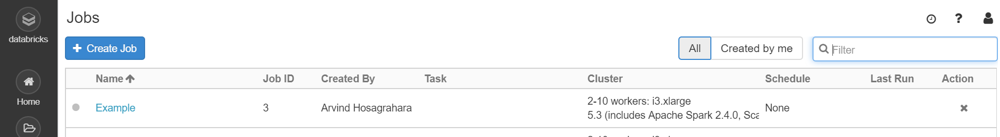

# Jobs API

A job allows users to create automation clusters based on a specified cluster configuration.
This allows creation and submission of jobs that will either use an existing cluster or create a new Spark&trade; cluster for the execution of the job.

## Create a job

A job can be created using the ```create``` method. If a cluster profile is specified, the job will create the Spark cluster based on the configuration.

For example:

```matlab
% Cluster object based configuration
cl = databricks.Cluster;
cl.setNumWorkers([2 10]);
% Note: do not specify cluster name
```

Furthermore, a job without a task (or a list of tasks), has no purpose, as it will not do anything.
As an example, create a notebook task.

```matlab
NT = databricks.NotebookTask();
nbPath = '/Shared/UnitTests/Simulink_3DOFs';
baseParams = struct('massLow', '1200', 'massHigh', '1400');
NT.notebook_path = nbPath;
NT.base_parameters = baseParams;
```

To create a new job using the cluster definition, minimally:

```matlab
jb = databricks.Job;
jb.name = 'Example';
jb.setCluster(cl);
jb.setTask(NT);
jb.create();
```

This will result in a job being created on the Databricks&reg; platform.
The job has still not run. It can be started through other methods on the `databricks.Job` object,
or by starting it from the Databricks web interface.



## List Jobs

A list of all jobs can be queried using:

```matlab
jobs = databricks.Job.list();
```

This will return a list of Jobs on Databricks as an array of Databricks jobs.

```matlab
>> jobs(1)

ans =

  Job with properties:

                   name: 'TestJob31-Jul-2019 13:16:16'
        timeout_seconds: 3600
            max_retries: 1
           created_time: 1.5646e+12
                 job_id: 8
            new_cluster: [1×1 struct]
    email_notifications: [1×1 struct]
    max_concurrent_runs: 1
      creator_user_name: 'user@example.com'
```

## Setup of Job-based event notifications

Databricks can be configured to send out email notifications on Job based events. To configure a job
to respond to these events by sending emails, users can use the `databricks.JobEmailNotifications` object.
For example:

```matlab
notify = databricks.JobEmailNotifications;
notify.on_start = 'user@example.com';
notify.on_success = 'user@example.com';
notify.on_failure = 'user@example.com';
```

An additional property `no_alert_for_skipped_runs` exists. If true, there will be no email sent to recipients specified in `on_failure` if the run is skipped.

This object can be attached to a job using the `setJobEmailNotifications` method.

```matlab
jb.setJobEmailNotifications(notify);
```

To set all of the notification conditions more concisely call:

```matlab
job.setJobEmailNotifications('user@example.com');
```

Or if a notification address is configured in `databricks-settings.json`, simply:

```matlab
job.setJobEmailNotifications();
```

## Connect to an existing job

A job on the databricks system is identified by a job_id. It is possible to connect to an existing job using its job_id.

```matlab
jb = databricks.Job;
jb.setJobId(87);
jb.refresh();

jb =

  Job with properties:

                   name: 'Untitled'
        timeout_seconds: 0
            max_retries: 1.00
                 job_id: 101.00
    max_concurrent_runs: 1.00
      creator_user_name: 'user@example.com'
           created_time: 1566439248663.00
    email_notifications: [1×1 struct]
            new_cluster: [1×1 struct]
```

## Run a job

To run a configured job:

```matlab
jb.runNow();
```

## Schedule a job

A job can be scheduled to run at a given time(s) using a Cron Schedule:

```matlab
% Sample job and cluster objects
cl = databricks.Cluster;
jb = databricks.Job;
jb.name = 'Example';
jb.setCluster(cl);

% Create a CronSchedule object
cs = databricks.CronSchedule;
% Configure its Quartz Cron Expression
% see: http://www.quartz-scheduler.org/documentation/quartz-2.3.0/tutorials/crontrigger.html
cs.setQuartzCronExpression("0 15 22 * * ?");
% Optionally set its execution to PAUSED or UNPAUSED
cs.setPauseStatus("UNPAUSED");
% Set the timezone for the schedule
cs.setTimezoneId("Ireland/Dublin");
% Apply the schedule to the job
jb.setSchedule(cs);

% Configure a task
task = databricks.MATLABBatchTask("disp(datetime)");
job.setTask(task);

jb.create();
```

## Run a job as a user or service principal

The setRunAs method specifies the user or service principal that the job runs as.
If not specified, the job runs as the user who created the job.
Only `user_name` or `service_principal_name` can be specified as the type.

Type `user_name` should specify the email of an active workspace user.
Non-admin users can only set this field to their own email.

Type `service_principal_name` should specify Application ID of an active
service principal. Setting this field requires the servicePrincipal/user
role.

```matlab
j = databricks.Job;
j.runAs("user_name", "joe@example.com");
```

```matlab
j = databricks.Job;
j.runAs("service_principal_name", "123bc6d0-ffa3-11ed-be56-1234ac123456");
```

[//]: #  (Copyright 2020-2025 The MathWorks, Inc.)
