# Setup

> This setup process formerly offered an admin mode.
> This has now been replaced with GitHub&reg; hosted admin centric content:
> [https://github.com/mathworks-ref-arch/matlab-on-databricks](https://github.com/mathworks-ref-arch/matlab-on-databricks)

If using MATLAB on Databricks&reg;, setup is usu­ally performed automatically when MATLAB
starts if installation of the MATLAB interface for Databricks is enabled.
No further action is required.

## Setup when working remotely

To begin setting up the MATLAB interface for Databricks change directory to the
`Software/MATLAB` directory and run `setup`.

Some steps will require Databricks admin permissions and the help of a
Databricks administrator who has already performed required steps in the
Github hosted Reference Architecture setup process.

Detailed information about supported releases of MATLAB, this package, Databricks
runtimes and Python&reg; can be found in: [SupportMatrix](SupportMatrix.md).

> If migrating from a version prior to 5.0.0, then configuration file changes
> require that old files are replaced. Archive existing settings files using
> `setup(archiveSettings=true)`. Alternatively backup: `[home directory]/.databricks-connect`,
> `[home directory]/.databrickscfg` & `[prefdir]/.databricks-settings.json` if desired.

> Tip: The `prefdir` command in MATLAB returns the preferences directory, see:
> `doc prefdir`, for details.

## Client side setup

If installing from a `.zip`, file paths for the package and its submodules must be
added to the MATLAB path. *After* running `setup` these paths can be added to the
permanent MATLAB path if desired. Alternatively run the package's `Software/MATLAB/startup`
command to set the paths and optionally perform other checks before using the package.

> Tip: Default or existing values are show in square brackets. Just press enter to select them.

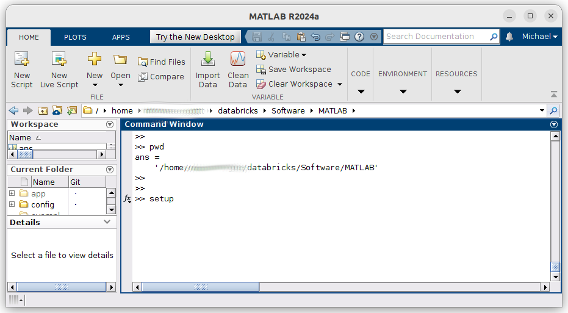

> Tip: Use the mouse *only* to *select*, *copy* and *paste* any links presented,
> clicking the links while MATLAB is busy or waiting on input can result in browser
> windows opening only when MATLAB finishes processing.

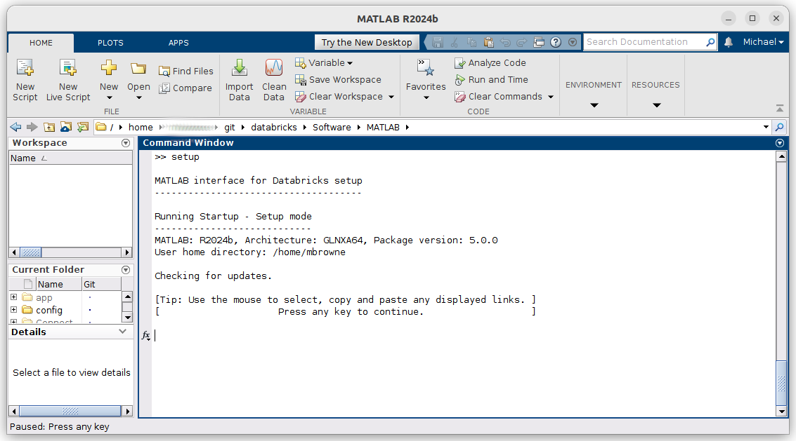

### Settings and configuration

Based on responses to the questions, several text files are used to record settings
and configuration values, for further details if required see *Configuration
and Settings file details* below.

> Tip: If rerunning setup for some reason and settings values have not changed this
> step can be skipped by choosing "N".

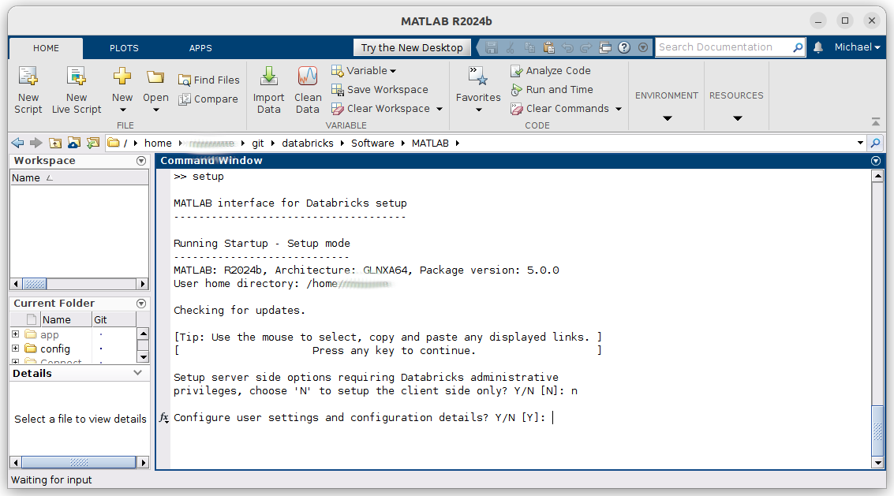

> Tip: If you copy and paste the complete Workspace URL, this often includes the
> required ?o=[org_id] parameter so it does not have to be provided separately.

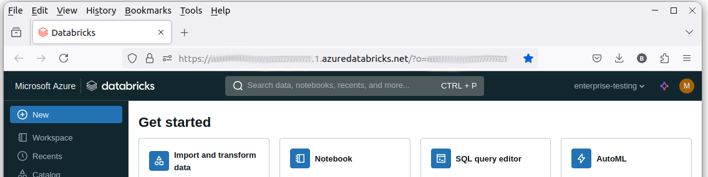

The simplest way to get the Databricks Workspace URL is to log into databricks and copy and
paste the value from the browser's address bar.

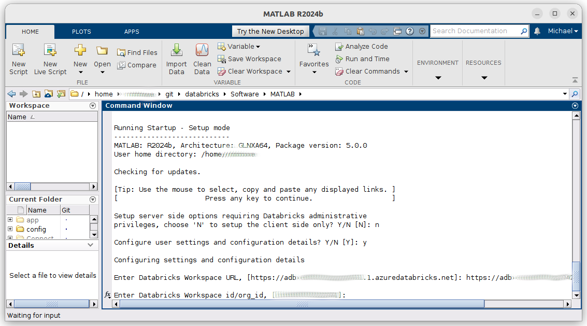

The `org_id` or Workspace Id is a numeric value that follows the `o=` parameter in the
Databricks Workspace URL, if unsure the Databricks admin will be able to provide this value.
It may also appear in the Workspace hostname itself.

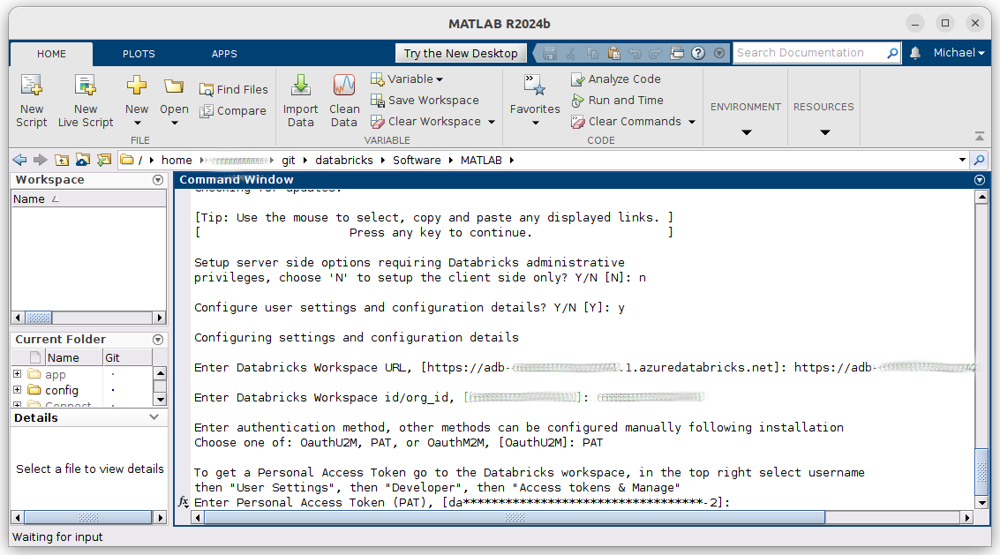

Select an authentication type, in this case `PAT` or Personal Access Token is selected.
Often this form of authentication will be disabled and another form must be used, typically
OauthU2M. The Databricks admin can advise on the preferred option.
See [Authentication](Authentication.md) for details on the supported authentication
mechanisms.

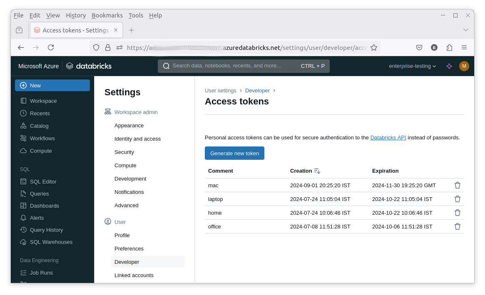

`PAT` requires a token which, if enabled, can be obtained from the Databricks Workspace.
*The token value is sensitive and should not be shared or exposed.*

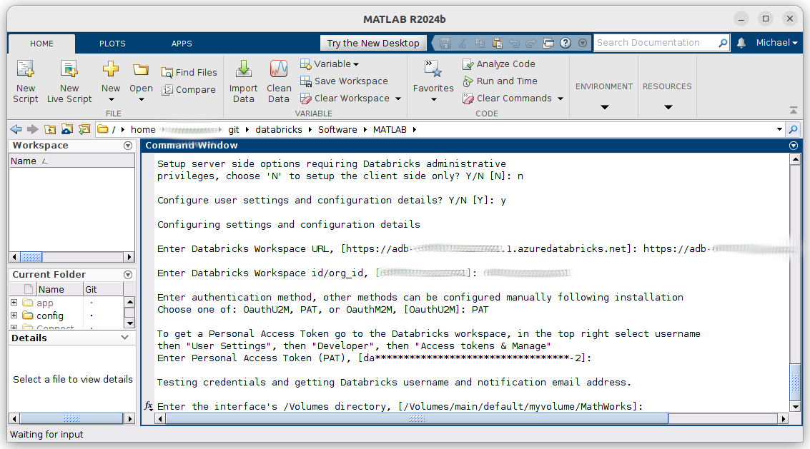

The credentials can be tested. To do so a call is made using the
`databricks.SCIM.me` method. This REST API method returns the Databricks username
(typically an email address) and the notification email address, allowing manual
entry of these values to be skipped if successful.

At this point the client side setup process intersects with the server side process
discussed below. A `/Volumes` path is required, this is the location where
the MATLAB runtime and associated files are stored. If this is not known or has
not yet been decided, use a temporary place holder value e.g. `/Volumes/main/default/myvolume/MathWorks`
and rerun `setup` to update the value later. This location is referred to as the
"Interface Directory". This is a central location that can be shared by MATLAB
users and it is good practice for the Databricks admin to make the location read-only
for robustness and security reasons.

### Databricks JDBC driver

The Databricks JDBC driver can be used along with Database Toolbox&trade; to access data in Databricks.
The driver is not included in this package and must be downloaded from
[Databricks](https://www.databricks.com/spark/jdbc-drivers-archive).
The associated license from Databricks must be accepted. This
license can be found here: [https://www.databricks.com/legal/jdbc-odbc-driver-license](https://www.databricks.com/legal/jdbc-odbc-driver-license).

For usage details see: [JDBCWorkflow](JDBCWorkflow.md).

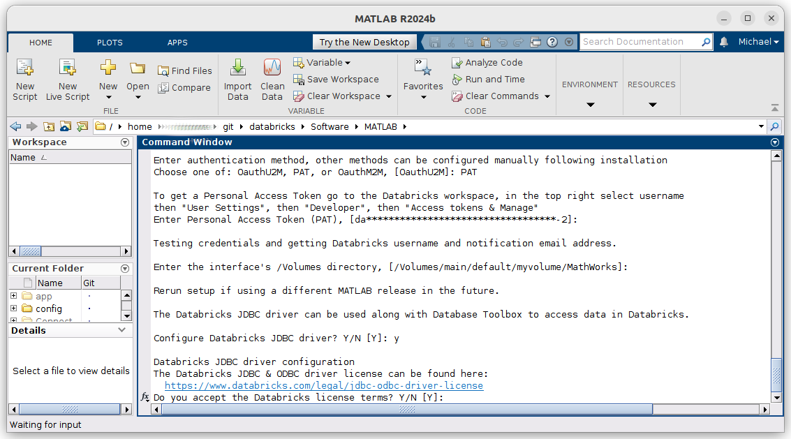

The Databricks ODBC driver is also supported and can be downloaded from: [https://www.databricks.com/spark/odbc-drivers-download](https://www.databricks.com/spark/odbc-drivers-download).

### Databricks Connect

Databricks Connect can be used to make interactive Spark&trade; API calls from MATLAB.
The Databricks Connect libraries are Python based and require a local Python installation.
Python 3.10, 3.11 & 3.12 are supported for Databricks runtimes 13.3, 14.3, 15.4, 16.4 & 17.3.

In this example the 13.3 and 14.3 versions of the libraries are setup. 15.4 is skipped
as this requires Python 3.11 which is not configured for use with MATLAB in this case.
See [Databricks Connect](DBConnect.md) for details of how to manually configure
alternate versions at a later stage.

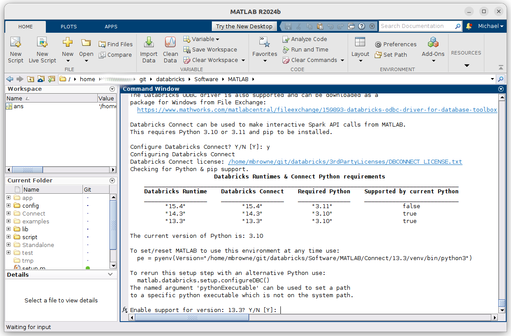

For usage details see: [DBConnectWorkflow](DBConnectWorkflow.md).

#### Note

* Setup may terminate a Python environment that is currently being used within MATLAB, requiring it to be restarted.
* A `requirements.txt` file is included for manual python environment configuration if preferred.

### MATLAB runtime license

The final step is to accept the MATLAB runtime license. This updates the local
copy of the `init script` used to deploy the MATLAB runtimes. It is expected that
a copy of this script has already been provisioned on the server side using the
server side workflow below.

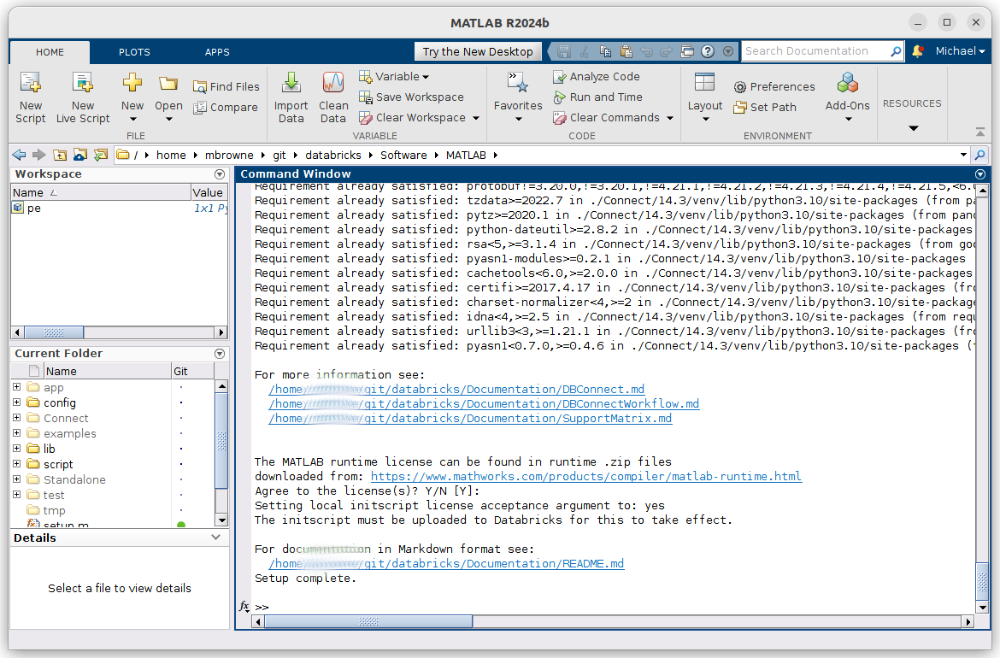

Use of the MATLAB runtime does not require connectivity to a license manager.

Setup of many aspects of the package is now complete.
A link to the top-level documentation in either HTML or Markdown is displayed.

*This concludes the client side setup process.*

### MATLAB runtime

As in the client only setup it is necessary to provide an *interface directory*, i.e.
a path in `/Volumes` to which MATLAB runtimes and associated files can be written.
Regular users can be restricted to having read only access to this directory.

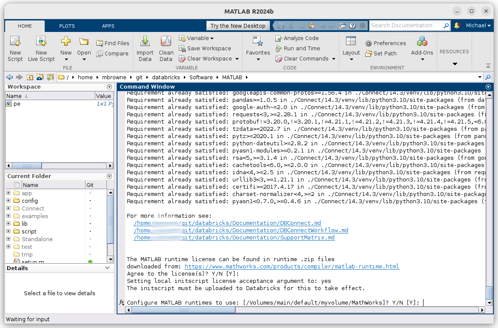

As new releases of this package are relatively frequent, see `[RELEASENOTES.md](../RELEASENOTES.md)`,
only two releases of the MATLAB runtime are produced each year the, *a* and *b*
releases. Interim update releases are produced to provide on going bug fixes.
These may be relevant and the latest release is always recommended but in general
there is no strict need to update the runtimes more frequently than the major releases.
The runtime releases must match the release of MATLAB used to compile
libraries being deployed to a given cluster.

#### Runtime .zip files

If the MATLAB runtime license is accepted then the next step is to select which
releases of the MATLAB runtime to support.
For more details on supported releases see: [SupportMatrix](SupportMatrix.md).

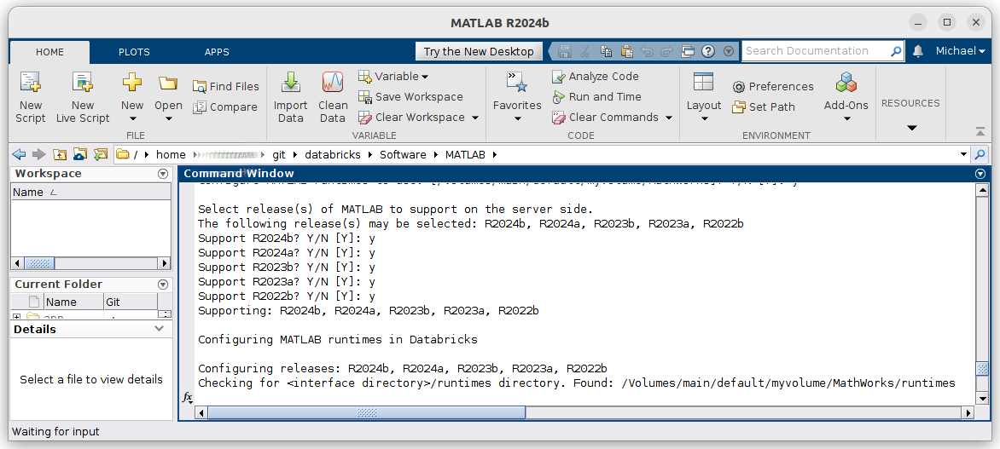

The MATLAB runtimes are large .zip files, c. 4.5GB. The most effective way to provision
them inside a Databricks environment is to create a notebook and use `%%sh` & `wget`
to download them directly from MathWorks.
The package dynamically generates the required command to copy and paste in a notebook.
As in this case if a file is already found the command is still generated as useful
reference but is commented out. If internet access from the cluster is prohibited then
the recommended approach is to use the links provided to download the zip files
elsewhere and upload them via the Databricks portal using the generated destination
link, this will take some time. In initial testing consider using just one runtime
to begin with.

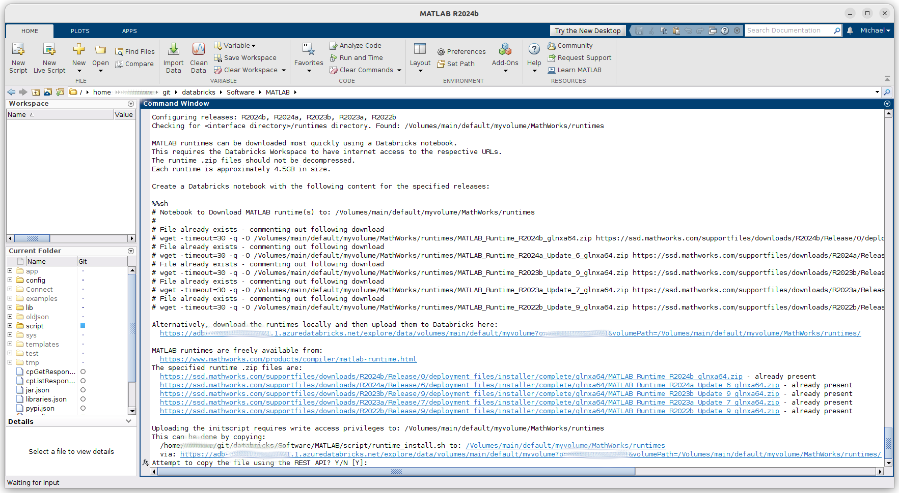

#### Init script

> From v7.0.0 the use of init scripts not supported on MATLAB runtime clusters that
> do not have internet access or that require Databricks runtime v17 or greater.

> From v6.0.0 the use of init scripts is deprecated and Docker&reg; is now the preferred,
> and in some cases required, way to deploy the MATLAB runtime to a databricks cluster.
> See: [Container Services](ContainerServices.md) & [https://github.com/mathworks-ref-arch/matlab-on-databricks/tree/main/resources/dockerfiles/runtime](https://github.com/mathworks-ref-arch/matlab-on-databricks/tree/main/resources/dockerfiles/runtime)

If not using a [docker based](ContainerServices.md) cluster provisioning approach,
so called [`init scripts`](https://docs.databricks.com/en/init-scripts/index.html)
are used to install MATLAB runtime on cluster nodes as the nodes boot.

A template init script is distributed with the package and if the runtime license
is accepted this can be uploaded to the `/[Interface Directory]/runtimes`. Alternatively it can
be manually uploaded via the Workspace GUI, the relevant link is generated.

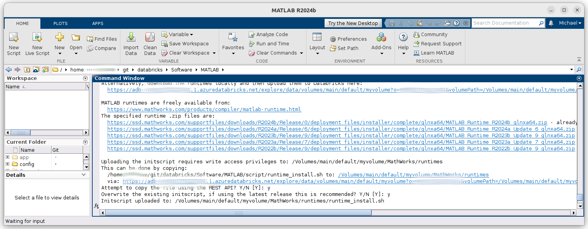

### Policy provision

Policies can be used to add preconfigured MATLAB entries to the Databricks Compute
interface. This step will typically require administrative privileges.
For details of policy configurations see: [https://github.com/mathworks-ref-arch/matlab-on-databricks/blob/main/guides/admin/create-cluster-policy-for-matlab-on-databricks.md](https://github.com/mathworks-ref-arch/matlab-on-databricks/blob/main/guides/admin/create-cluster-policy-for-matlab-on-databricks.md)

> With sufficient privileges the package can create the polices directly using the REST API.

See also: [https://docs.databricks.com/en/admin/clusters/policies.html#libraries](https://docs.databricks.com/en/admin/clusters/policies.html#libraries.)

## Configuration and Settings files further details

| File name                  | Type          | Format | Default location       | More details |
| -------------------------- | ------------- | ------ | ---------------------- | ------------ |
| `.databrickscfg`           | Configuration | INI    | Home directory         | [Authentication.md](Authentication.md) |
| `databricks-settings.json` | Settings      | JSON   | `prefdir`              | See below    |
| `databricks-http.json`     | Settings      | JSON   | Software/MATLAB/config | See below    |

The files are divided into two types, *settings* and *configuration*. The distinction is
simply that *settings* files are only used by this package and the *configuration* file
is also used by Databricks tools and libraries e.g. the Databricks CLI and Databricks Connect.
These files can be customized using a text editor e.g. the MATLAB® editor.
Typically only `.databrickscfg` and `databricks-settings.json` are customized.

* The `databricks-settings.json` full path is given first by the `DATABRICKS_SETTINGS_FILE`
environment variable, if set. If not, the default directory is the user's MATLAB `prefdir`
directory and otherwise the MATLAB path. Note this makes it specific to MATLAB releases which
must be considered if using multiple releases.
* The `.databrickscfg` full path is given first by `DATABRICKS_CONFIG_FILE` environment
variable, if set. If not the default directory is the user's home directory and
otherwise the MATLAB path. This file may also be used by Databricks packages such as the [CLI](https://docs.databricks.com/en/dev-tools/cli/index.html).
* `databricks-http.json` controls HTTP connection properties and is rarely changed, it is located
in the the package's `Software/MATLAB/config` directory. It can be moved if required but should
remain on the MATLAB path.
* The `runtimes.json`, `.databricks-connect` and `javaclasspath.txt` files used by versions prior
to v5.0 are no longer required.

### Manually configuring `databricks-settings.json`

The template settings file `Software/MATLAB/config/databricks-settings.json.template`,
when populated is stored in `fullfile(prefdir, 'databricks-settings.json')` by default.
For a typical Windows&reg; user this is `C:\Users\someuser\.matlab\R2024a\databricks-settings.json`.

If necessary change the vendor value to *aws* or *azure* depending on the cloud
environment in use. Change the default node machine type if desired. Configure a
notification email address that can optionally be used for job status notifications.

The default Databricks runtime version used when creating a cluster can be changed
by updating the `defaultDatabricksRuntime` value.

### Configuring `databricks-http.json`

If necessary change the `databricks-http.json` file to override the settings that the package
uses for REST based communication. In general the default values should suffice. In this case
a template and a preconfigured file are provided. For details see: [https://www.mathworks.com/help/matlab/ref/matlab.net.http.httpoptions-class.html](https://www.mathworks.com/help/matlab/ref/matlab.net.http.httpoptions-class.html).

[//]: #  (Copyright 2020-2026 The MathWorks, Inc.)
