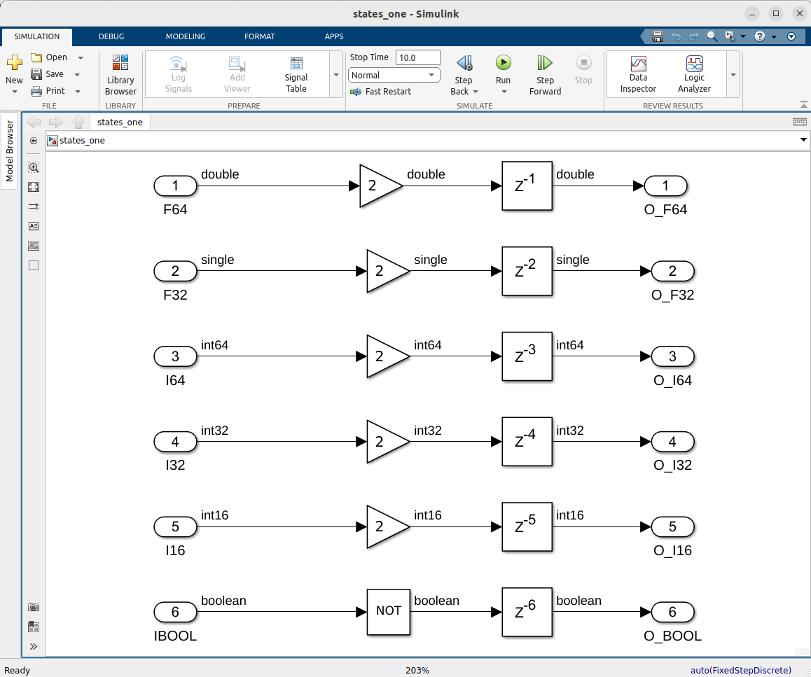
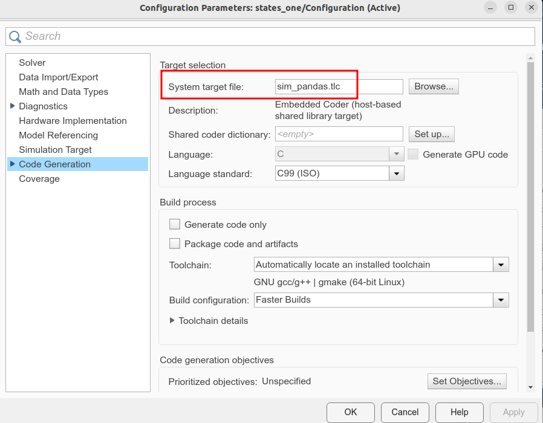
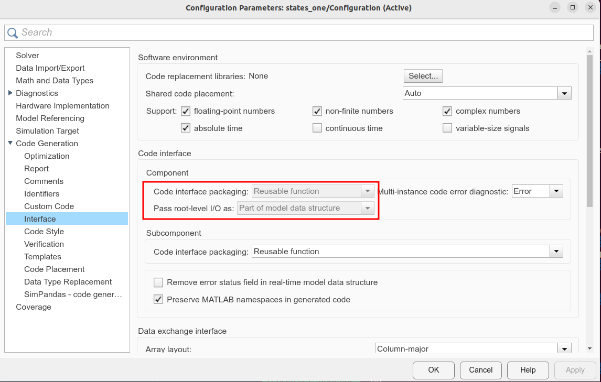

# Code generation

> **Note:**  There are different constraints and different advantages and
> disadvantages to using either the Compiler workflows or the Coder workflows.
> The differences can be found in the documentation of the respective products,
> so it won't be discussed at length here.

## Introduction

Code generation can be used to convert a Simulink&reg; model to a shared library (`.so`),
which can then be used in a Spark/Databricks&reg; computation. In general, this feature
relies on a Simulink&reg; model being fed data from a Pandas DataFrame.

> **Note:** This feature can currently only be used on a Linux&reg; platform, as
> Databricks nodes are always running Linux.
> A `.so` is a binary, and thus a platform dependent library. As such,
> it must be used on the same platform it was compiled for.

## Required products

* MATLAB&reg;
* Simulink&reg;
* MATLAB&reg; Coder&trade;
* Simulink&reg; Coder&trade;
* Embedded Coder&reg;

To see what products are installed, perform the the command `ver` in a
MATLAB&reg; command window.

## Restrictions

Not all Simulink&reg; models will be suitable for this workflow.
At least the following requirements must be fulfilled:

* The model must have a fixed sample-time
* The data fed to the model must have the same sample time has the model
* Only scalar inport and outport data is supported (this may change in a later version)

## Example

This example contains a very simple model used to show the basic aspects of this feature.
The demo can be found in the Databricks package at
`Software/MATLAB/examples/Preview/CodeGeneration/Simulink/`.

The model is called `states_one`, and is the simple model shown in the
picture below.


As can be seen, it has 6 inports and 6 outports. The datatypes are
`double`, `single`, `int64`, `int32`, `int16` and `boolean` respectively.

The configuration of the model must be set to `sim_pandas.tlc` as the code generation
target, and furthermore the _Code interface  packaging_ must be set too _Reusable function_
and the _Pass root-level I/O as_ must be set to _Part of model data structure_,
as seen in the images below.

> **Note:** Provided the Databricks/Spark package was installed correctly, the
> `sim_pandas.tlc` target will be found by clicking the _Browse_ button in
> the picture.





> **Note:** This functionality is still being developed. The exact interface
> may change as the feature matures.

### Building

To build the model, it suffices to either start the build from within the model
(e.g. by pressing CTRL+B), or from the commandline:

```matlab
slbuild("states_one")
```

This will build the shared object (`states_one.so`) in the same directory.
In the directory with the generated code, `states_one_sim_pandas`, the code
is found, as well as a Python&reg; library (its source code), some MATLAB&reg; helper functions
for testing the code, and a `.zip` file artifact of the Python library.

The Python library is what will be calling the shared object, and it will contain
some functions to easily interact with the shared object.

The Python package will have the general name `simutil.<MODELNAME>_wrapper.simpandas`,
in this case `simutil.states_one_wrapper.simpandas`.
> **Note:** This name may be parameterizable in a later version.

```bash
simutil
└── states_one_wrapper
    └── simpandas.py
```

This package contains 2 functions for executing the compiled version of the model,

```python
def run_sim(pdf_in: pd.DataFrame):
    """ run_sim
    This function will run a Simulink® simulation with inputs from
    the Pandas DataFrame argument """
```

and

```python
def run_sim_iter(iterator):
    """ A function to be used with mapInPandas.
    It takes an argument an iterator over Pandas DataFrames"""
```

### Example functions

Please note that these example functions must all be called from within the
code generation folder. This is to ensure that the library can be found.

#### MATLAB Example

The function `<MODELNAME>_matlab_example` (here `states_one_matlab_example`)
can be used to call the library from within MATLAB&reg;.

It takes a MATLAB&reg; table, converts it to a Pandas DataFrame, and calls the
Python library (which invokes the shared library, i.e. the `.so` file).
This returns another Pandas DataFrame,
which is converted to a MATLAB&reg; table, which is returned by the function.

```matlab
function T_OUT = states_one_matlab_example(N)
    % states_one_matlab_example
    % Example to call .so from MATLAB.
   
    arguments
        N (1,1) double = 100
    end

    In1 = double(1:N)';
    In2 = int64(1:N)';
    In3 = double(1:N)';
    
    % Create MATLAB table for inputs
    T_IN = table(In1, In2, In3);

    % Convert this to a Pandas DataFrame
    pdf_in = py.pandas.DataFrame(T_IN);

    % Call the SO through the Python package
    pdf_out = py.simutil.states_one_wrapper.simpandas.run_sim(pdf_in);

    % Convert Python DataFrame to MATLAB table
    T_OUT = table(pdf_out);

end
```

#### Python Example

The function `<MODELNAME>_python_example` (here `states_one_python_example`)
can be used to call the library from within Python.

It creates a Pandas DataFrame and calls the
Python library (which invokes the shared library).
This returns another Pandas DataFrame which is printed out.

```python
# states_one_python_example.py
# Example to call SO from Python.

import numpy as np
import pandas as pd

import simutil.states_one_wrapper.simpandas as swo

def main():
    N = 100

    # Create some example data
    col_In1 = np.asarray(range(N), dtype='float')
    col_In2 = np.asarray(range(N), dtype='int')
    col_In3 = np.asarray(range(N), dtype='float')
    
    # Create DataFrame for input data
    pdf_in = pd.DataFrame(data={'In1': col_In1, 'In2': col_In2, 'In3': col_In3})
    print(f'pdf_in:\n{pdf_in}')

    # Run simulation
    pdf_out = swo.run_sim(pdf_in)

    # Print the output
    print(f'pdf_out:\n{pdf_out}')
if __name__ == "__main__":
    main()
# End of file: states_one_python_example.py 
```

#### Notebook Example

This example runs in a notebook on Databricks. In this example, the notebook
will be called `states_one_notebook_example.py`, and is located in the output
directory, `states_one_sim_pandas`.

It can be imported to Databricks through the portal, or by calling a helper
function in MATLAB&reg;.

> **Note:** Many Apache&reg; Spark&trade; environments also support notebooks, but there are
> currently no MATLAB&reg; functions in this package to facilitate the upload.
> Apart from this, the workload should be similar, though.

```matlabsession
matlab.databricks.workspace.import(...
    "states_one_notebook_example.py", ...
    "/Users/user@example.com/tmp", ...
    printURL=true)
```

Please note that the destination directory, in this case
`"/Users/user@example.com/tmp"`, must already exist in the workspace.

Doing this upload will also output a hyperlink for opening the notebook.
The notebook starts with some comments stating that the wheel file must first be
uploaded to the Databricks environment. It contains example MATLAB&reg; code for doing this,
in this example it looks like this:

```matlab
F = databricks.Files();
F.upload( ...
  '/matlab-databricks/Software/MATLAB/examples/Preview/CodeGeneration/Simulink/states_one_sim_pandas/dist/simutil_states_one_wrapper-24.2.0-py3-none-any.whl', ...
  '/Volumes/main/default/myvolume/MATLABExamples/states_one/simutil_states_one_wrapper-24.2.0-py3-none-any.whl')
```

The code can be copied and executed in MATLAB&reg;, which will upload the file. The next
cell contains code for installing this on the cluster, `%pip install ...`.

The full contents of this notebook is as seen below. The data is random, but of the
right type. It's meant as a starting point for how this can be used.

```python
#Databricks notebook source
#DBTITLE 1,Example for states_one_wrapper
# This notebook contains example for states_one_wrapper

#COMMAND ----------

#DBTITLE 1,Install the wheel file
# MAGIC %md
# MAGIC # Install the wheel file
# MAGIC To install the wheel file, it must be available on the cluster.
# MAGIC 
# MAGIC It can be uploaded from the MATLAB session where it was created like this:
# MAGIC 
# MAGIC ```matlab
# MAGIC F = databricks.Files();
# MAGIC F.upload( ...
# MAGIC   '/local/EI-DTST/Platforms/azure-databricks-https/Software/MATLAB/examples/Preview/CodeGeneration/Simulink/states_one_sim_pandas/dist/simutil_states_one_wrapper-24.2.0-py3-none-any.whl', ...
# MAGIC   '/Volumes/main/default/myvolume/MATLABExamples/states_one/simutil_states_one_wrapper-24.2.0-py3-none-any.whl')
# MAGIC ```

#COMMAND ----------

#DBTITLE 1,Install the wheel file
# Provided the wheel has been uploaded (see previous cell), it can now be installed
%pip install /Volumes/main/default/myvolume/MATLABExamples/states_one/simutil_states_one_wrapper-24.2.0-py3-none-any.whl --force-reinstall

#COMMAND ----------

#DBTITLE 1,Imports
import pandas as pd
from pyspark.sql.types import *

#COMMAND ----------

#DBTITLE 1,Helper functions for madeup data
def C_F64__ex(num):
    """Example code for C type c_double, column C_F64_."""
    return float(num)

def C_F32__ex(num):
    """Example code for C type c_float, column C_F32_."""
    return float(num)

def C_I64__ex(num):
    """Example code for C type c_int64, column C_I64_."""
    return int(num)

def C_I32__ex(num):
    """Example code for C type c_int32, column C_I32_."""
    return int(num)

def C_I16__ex(num):
    """Example code for C type c_int16, column C_I16_."""
    return int(num)

def C_IBOOL__ex(num):
    """Example code for C type c_bool, column C_IBOOL_."""
    return num % 2 == 0


#COMMAND ----------

#DBTITLE 1,Generate the example data
N = 10000
DATA = list()
for di in range(N):
    DATA.append((C_F64__ex(di + 0), C_F32__ex(di + 1), C_I64__ex(di + 2), C_I32__ex(di + 3), C_I16__ex(di + 4), C_IBOOL__ex(di + 5),))

#COMMAND ----------

#DBTITLE 1,Create Dataframe schema
dfSchema = StructType([StructField('F64', DoubleType(), True), StructField('F32', FloatType(), True), StructField('I64', LongType(), True), StructField('I32', IntegerType(), True), StructField('I16', ShortType(), True), StructField('IBOOL', BooleanType(), True)])
dfSchema

#COMMAND ----------

#DBTITLE 1,Create the actual Dataframe
DF = spark.createDataFrame(DATA, dfSchema)

#COMMAND ----------

#DBTITLE 1,Show some example data
DF.show(10, False)

#COMMAND ----------

#DBTITLE 1,Run mapInPandas example
from simutil.states_one_wrapper.simpandas import run_sim_iter
DF_OUT = DF.mapInPandas(run_sim_iter, schema='O_F64 double, O_F32 float, O_I64 long, O_I32 int, O_I16 short, O_BOOL boolean');


#COMMAND ----------

#DBTITLE 1,Check results
DF_OUT.show(10, False)
```

#### Spark Example

This example calls Databricks from within MATLAB&reg;.

> **Note:** The current version of this feature will assume that the `.so` file
> is found on a _Volume_ in the Databricks environment.
> For this example:
> `/Volumes/main/default/myvolume/MyWheels/DLLs/states_one.so`
> This will be possible to vary in a later version.

This example first creates a Spark Session (by default a serverless one),
and adds the zip artifact with the `addArtifact` method.
It creates a Spark DataFrame dynamically (with synthetic data),
and then performs a `mapInPandas` with the `run_sim_iter` function.

The resulting DataFrame is converted to a MATLAB&reg; table and returned
from the function.

```matlab
function T_OUT = states_one_spark_example(options)
    % states_one_spark_example
    % Example to call .so from MATLAB.
    % The default is to use a serverless session. If this is
    % not desired, please specify the additional argument serverless=false.
    % NOTE: This example currently only works with Databricks

    arguments
        options.N (1,1) double = 100
        options.serverless (1,1) logical = true
        options.profileName (1,1) string
        options.authMethod (1,1) matlab.databricks.AuthMethod
    end

    % Get a serverless Spark Session
    args = matlab.utils.addArgs(options, ["authMethod", "profileName", "serverless"]);
    spark = databricks.PySparkSession(args{:});

    % Add the zip artifact to the session
    spark.addArtifact('states_one_artifact.zip', pyfile=true);

    % Create some example data
    R = spark.range(options.N);
    DF = R ...
        .withColumn('In1', R.col('id').cast('double')) ...
        .withColumn('In2', R.col('id').cast('long')) ...
        .withColumn('In3', R.col('id').cast('double')) ...
        .select('In1', 'In2', 'In3');
    
    % Run as mapInPandas
    pyrun("from simutil.states_one_wrapper.simpandas import run_sim_iter")
    DF_OUT = DF.mapInPandas("run_sim_iter", schema="'Out1 double, Out2 long, Out3 double'");

    % Create MATLAB table
    T_OUT = DF_OUT.table();

end
```

[//]: #  (Copyright 2024-2026 The MathWorks, Inc.)
