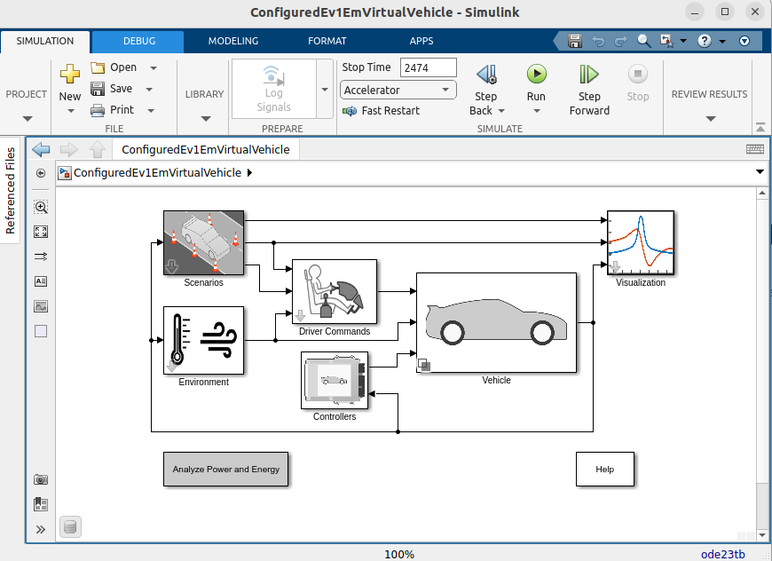
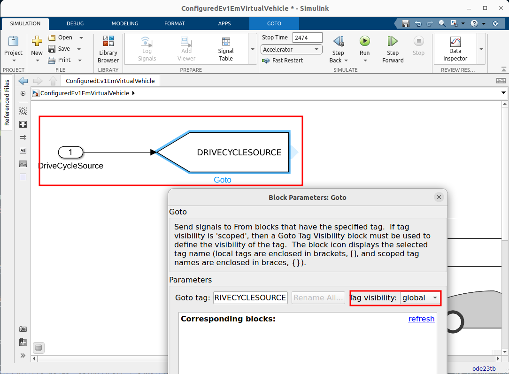
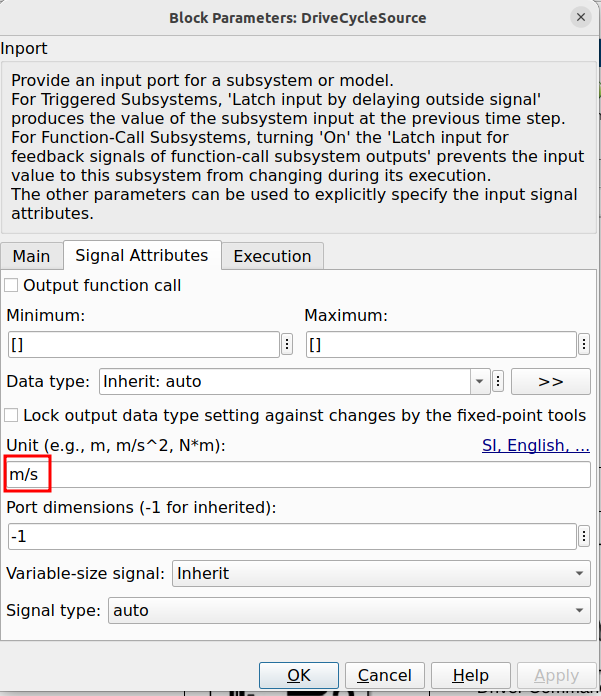
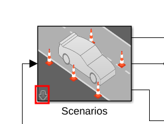
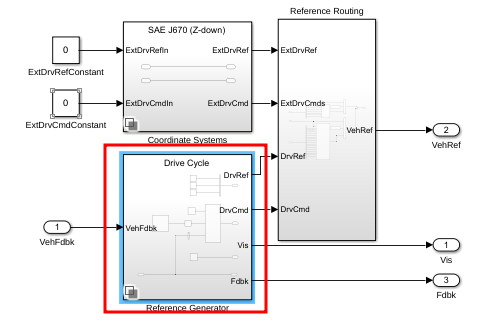
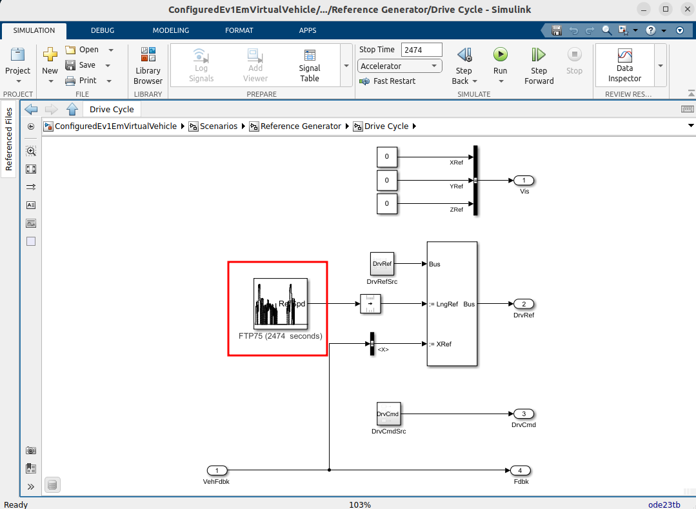
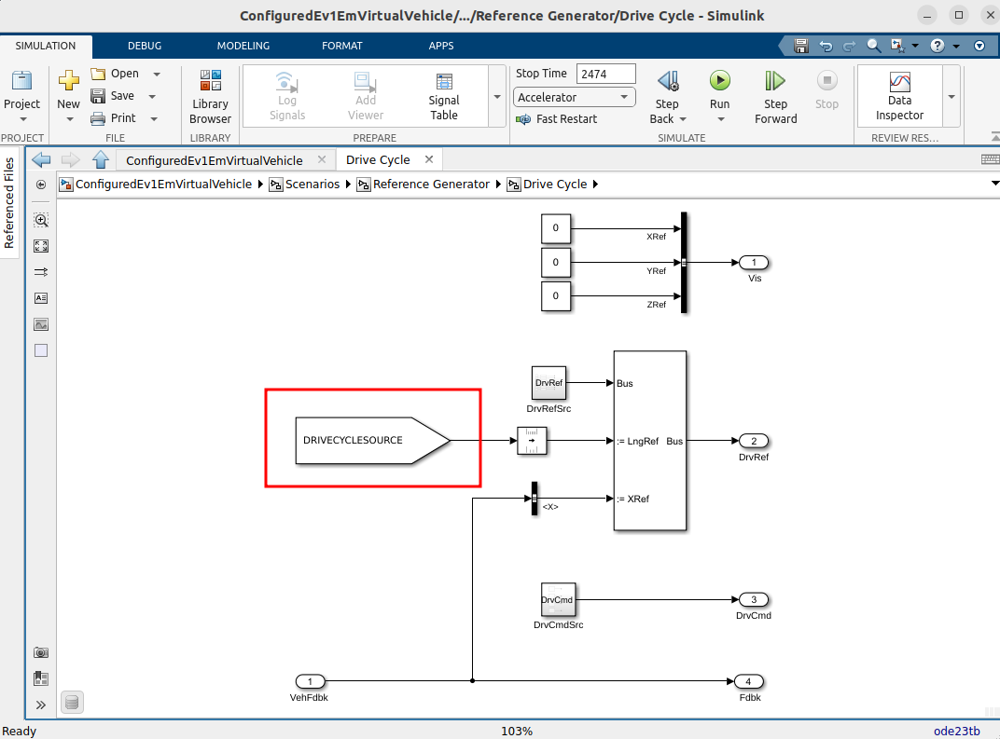
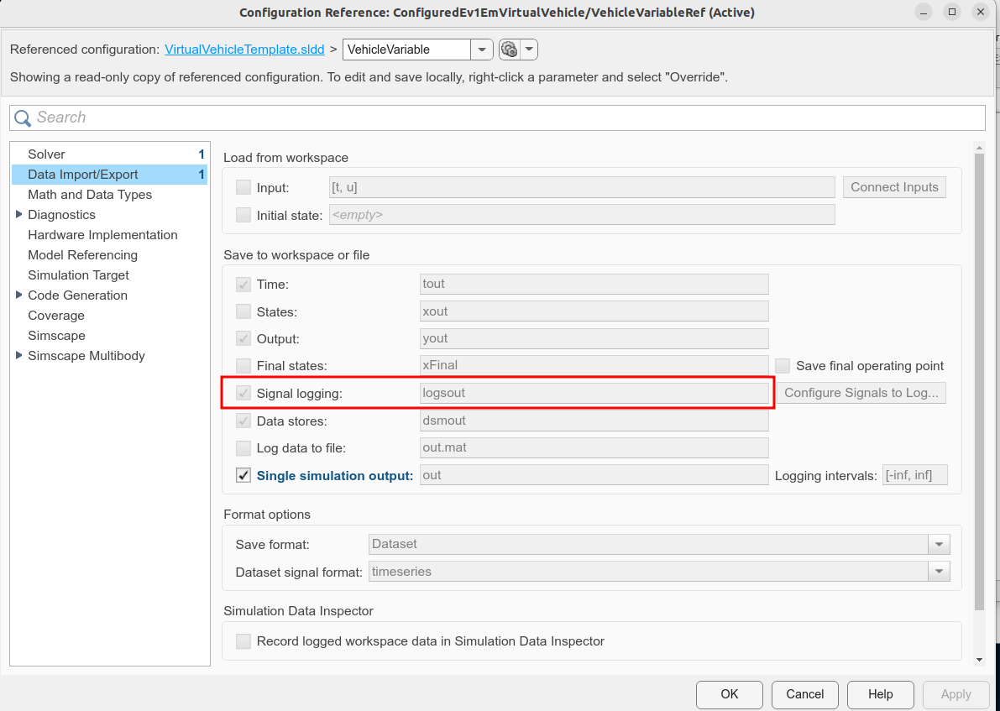

# Virtual Vehicle example

## Introduction

For version specific documentation for MATLAB R2022b to R2023b and see [`README_R2023b.md`](README_R2023b.md) instead. For releases newer than R2023b continue with this document.

> *Note* Currently this example fails in R2024a, due to the inability to change the
> signal name for `VelocityRef`. This is under investigation, a newer release is
> recommended.

## Requirements

* MATLAB
* Simulink
* MATLAB&reg; Compiler&trade;
* MATLAB&reg; Compiler SDK&trade;
* Simulink&reg; Compiler&trade;
* Simscape&trade;
* Powertrain Blockset&trade;
* Vehicle Dynamics Blockset&trade;
* Vehicle Network Blockset

> *Note:* This example can only be compiled on a Linux&reg; system to produce a binary
> that will run on Linux, as used by the Databricks&reg; cluster. Running MATLAB itself
> on Databricks is one way to achieve this.

> For details of running MATLAB *on* Databricks see: [https://github.com/mathworks-ref-arch/matlab-on-databricks](https://github.com/mathworks-ref-arch/matlab-on-databricks)
> This uses the Linux version of MATLAB.

## Setup

### 1. Create a working copy of the example

Before running the example, copy it to a temporary directory by running:

```matlab
workDir = fullfile(tempdir, "Simscape");
copyfile(databricksRoot("examples", "Simscape"), workDir)
cd(workDir)
```

### 2. Run the demo creation command

The `pwd` argument creates it in the current folder, the one moved to in the
previous step.

```matlab
autoblkEvStart(pwd)
```

This will automatically open the freshly created project, and open the example
model, `ConfiguredEv1EmVirtualVehicle`.

It will also switch the directory to
`Simscape/VirtualVehicle/VirtualVehicle/System/ConfiguredVirtualVehicle`.


### 3. Swap out the DriveCycleSource block

At the top level, add an _Inport block_, and connect it to a _Goto block_
(with the tag `DRIVECYCLESOURCE`) as follows:



Make sure the _Inport block_ has a unit of `m/s` set.



### 4. Swap out the source block

Go down in the scenarios subsystem



And then double-click the generator



This brings you to the subsystem
`ConfiguredEv1EmVirtualVehicle/Scenarios/Reference Generator/Drive Cycle`.
Remove the DriveCycleSource block (highlighted in red)



Now insert a _From block_, with the same tag as in the _Goto block_ (`DRIVECYCLESOURCE`)



### 5. Verify settings

Open the model settings (`CTRL+E`), and verify that logging of output signals is selected.


### 6. Try running model with external outputs

First, move back up to the example working directory.

```matlabsession
cd(workDir);
```

We are now at a point where we can simulate the model with external data.
> *Note:* If this is the first time the simulation is run, it will take some time,
> as the models must first be compiled.

```matlabsession
>> outputs = runEv1Em(makeCycleTable(100))
outputs =
  20071x13 table
       Time       AccelFdbk    BattCurr    BattSoc    BattVolt    DecelFdbk      EMSpd       EMTrq     GearFdbk        ax         ay       az           xdot   
    __________    _________    ________    _______    ________    _________    __________    ______    ________    ___________    __    _________    __________
             0           0           0         60      363.71         0                 0         0       0                  0    0        1.0003             0
    1.6177e-05           0           0         60      363.71         0        7.2178e-33         0       0         5.4087e-15    0        1.0003    1.0862e-18
    9.7064e-05           0           0         60      363.71         0        1.4159e-25         0       0          1.026e-12    0        1.0001    1.2174e-15
     0.0005015           0           0         60      363.71         0        1.3147e-18         0       0          1.098e-10    0       0.99907      8.05e-13
     0.0025237           0           0         60      363.71         0        4.2825e-12         0       0         4.3715e-10    0       0.99316    4.1176e-10
     0.0045584           0           0         60      363.71         0        1.4051e-10         0       0        -3.6981e-08    0         0.986    3.3135e-09
        :             :           :           :          :            :            :           :          :             :         :         :            :     
         99.98    0.039167      28.964     56.824      359.92         0            510.99    16.346       1          0.0091499    0      0.008112        18.472
         99.98    0.039166      28.963     56.824      359.92         0            510.99    16.345       1          0.0091485    0     0.0081125        18.472
         99.99    0.039113      28.923     56.824      359.92         0            511.01    16.321       1          0.0091081    0     0.0080563        18.473
         99.99    0.039112      28.921     56.824      359.92         0            511.01     16.32       1          0.0091068    0      0.008057        18.473
           100    0.039061      28.883     56.824      359.92         0            511.04    16.296       1           0.009068    0     0.0080072        18.474
           100     0.03906      28.881     56.824      359.92         0            511.04    16.296       1          0.0090669    0     0.0080106        18.474
    Display all 20071 rows.
```

> Note: A warning with respect to visualization blocks in compiled mode may be shown,
> but this can be ignored.

The input to the simulation is from the function `makeCycleData`, which simply creates
some trigonometric input data. The argument indicates how many seconds it should run.

### 7. Compiling the model

In order to compile the model, a few steps must be performed.

First, a `schema` must be generated. This will create a file `runEv1Em.schema`,
containing information about the input and output data types for the function.
This is necessary, as it helps the compiler framework generate optimized 
marshalling code for the inputs and outputs. As we'll be running this model
on Databricks, data must be converted from Databricks to Compiled MATLAB,
and back again.

```matlab
generateFunctionSchema("runEv1Em", {makeCycleTable(10)})
```

When this is done, the library can be built. Use the function
`buildLibraryEv1Em`.

```matlabsession
>> PSB = buildLibraryEv1Em()
% Lots of output ...
PSB = 
  PythonSparkBuilder with properties:

       BuildResults: [1x1 compiler.build.Results]
          BuildOpts: [1x1 compiler.build.PythonPackageOptions]
            PkgName: "sldemo.virtualvehicle"
          PkgFolder: []
          OutputDir: '/tmp/Simscape/_build_ev1em'
             SrcDir: "/tmp/Simscape/_build_ev1em/sldemo/virtualvehicle"
              Files: [1x1 compiler.build.spark.PythonFileV2]
       GenMatlabDir: "/tmp/Simscape/_build_ev1em/matlab_helpers"
        HelperFiles: ["/tmp/Simscape/_build_ev1em/matlab_helpers/runEv1Em_mapPartitions.m"    …    ] (1x2 string)
       ExampleFiles: [1x2 table]
    ZipArtifactName: "/tmp/Simscape/_build_ev1em/sldemo.virtualvehicle_Artifact.zip"
```

### 8. Running it on the cluster

To run the model on a cluster (with artificial data), the following steps can be followed:

Upload the wheel file to the cluster, either through the portal, or as follows,
customize the `/Volumes` path:

```matlab
f = databricks.Files();
[wf, wp] = PSB.getWheelFile();
f.upload(wf, "/Volumes/main/default/myvolume/MyWheels/" + string(wp));
```

Import the example notebook, customize the location as needed:

```matlab
matlab.databricks.workspace.import('runEv1Em_notebook.py',"/Users/username@example.com/Examples")
```

Open the notebook in the Databricks portal, attach it to a cluster.
The cluster, of course, needs to have the correct MATLAB Runtime installed.

Customize the `%pip install` command to reflect where the wheel file was uploaded.

Customize the `save_name` variable, to select where the results should be saved.
