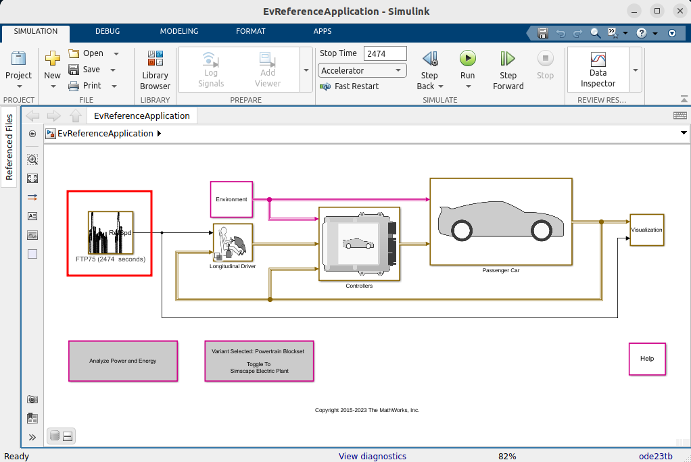
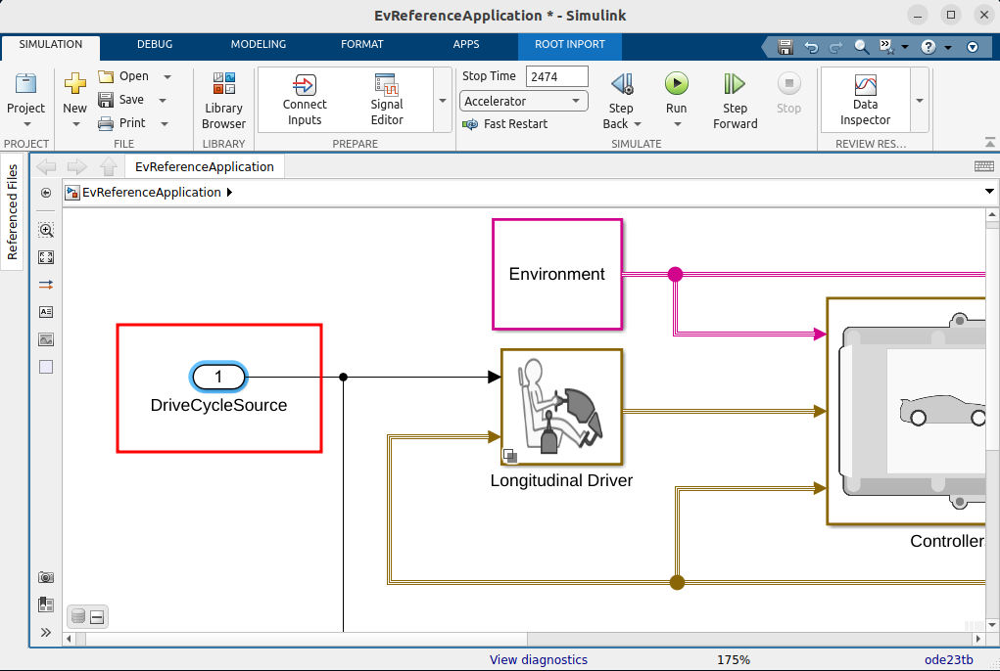
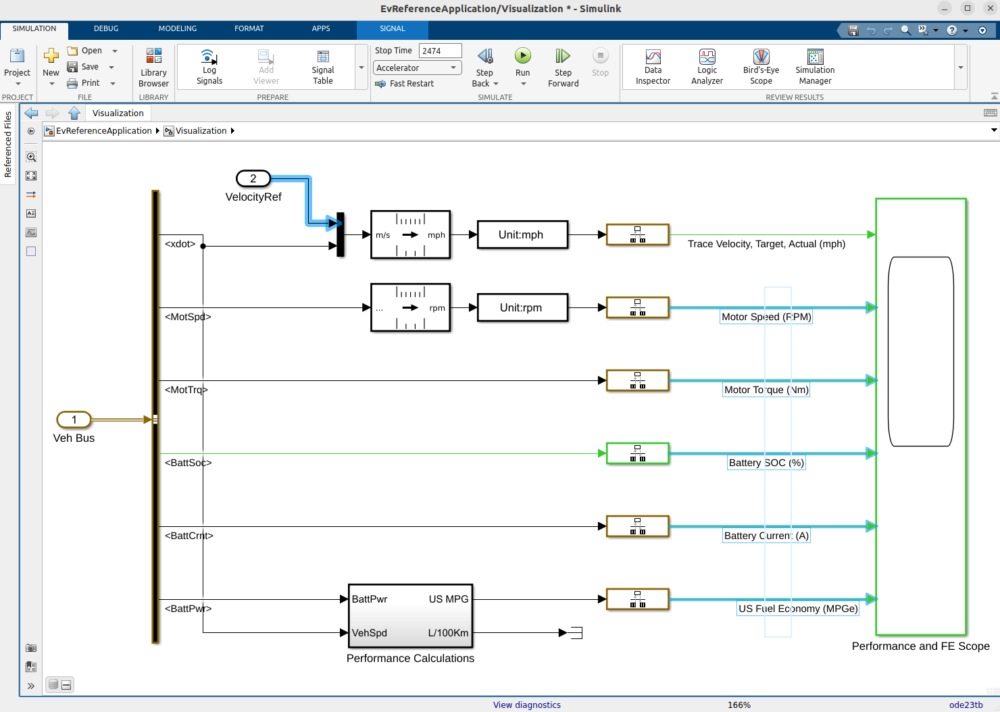
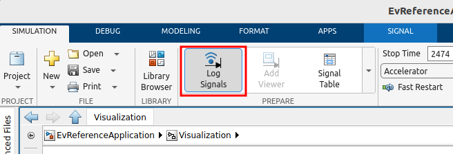
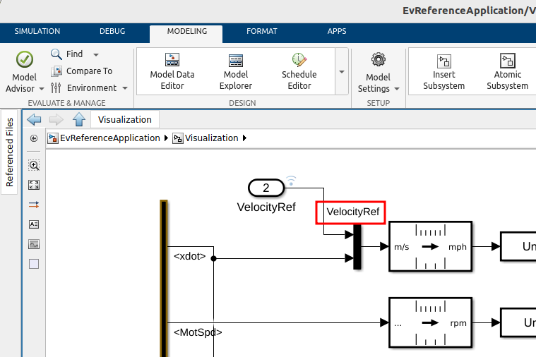
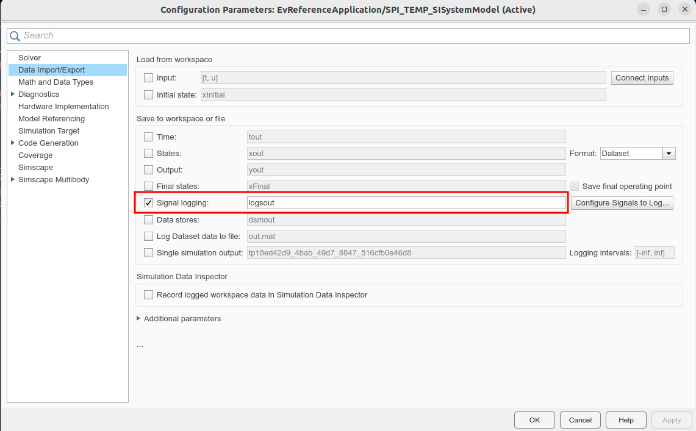

# Virtual Vehicle demo

## Introduction

For version specific documentation for MATLAB R2023b and greater see [`README.md`](READM.md)
instead. For releases R2023b and older continue with this document.

## Requirements

* MATLAB
* Simulink
* MATLAB&reg; Compiler&trade;
* MATLAB&reg; Compiler SDK&trade;
* Simulink&reg; Compiler&trade;
* Powertrain Blockset&trade;

> *Note:* This example can only be compiled on a Linux&reg; system to produce a binary
> that will run on Linux, as used by the Databricks&reg; cluster. Running MATLAB itself
> on Databricks is one way to achieve this.

## Setup

### 1. Create a working copy of the example

Before running the example, copy it to a temporary directory by running:

```matlab
workDir = fullfile(tempdir, "Simscape");
copyfile(databricksRoot("examples", "Simscape"), workDir)
cd(workDir)
```

### 2. Run the demo creation command

The `pwd` argument creates it in the current folder, the one moved to in the
previous step.

```matlab
autoblkEvStart(pwd)
```

This will automatically open the freshly created project, and open the example
model, `EvReferenceApplication`.

It will also switch the directory to `Simscape/EV/EV`.


### 3. Swap out the DriveCycleSource block

Switch out this block, highlighted in red above, for an _Inport_, as seen in this image.


### 4. Add logging signals

Go into the _Visualizaton_ block (on the right side of the model), and select the following signals:
`Battery SOC (%)`, `Motor Speed (RPM)`, `US Fuel Economy (MPGe)`, `Motor Torque (Nm)`,
`Battery Current (A)`, `VelocityRef`,
as seen in the image.


Now select to log these signals by clicking the icon:


Furthermore, make sure you add a name to the signal in the upper left corner.
Double-click the signal line, give it the name `VelocityRef`, and hit _Enter_.



### 5. Verify settings

Open the model settings (`CTRL+E`), and verify that logging of output signals is selected.


### 6. Try running model with external outputs

First, move back up to the example working directory,

```matlabsession
cd(workDir);
```

We are now at a point where we can simulate the model with external data.
> *Note:* If this is the first time the simulation is run, it will take some time,
> as the models must first be compiled.

```matlabsession
>> output = runEvRefApp(makeCycleTable(100))

output =
  1001x7 table
    Time    BattSoc    MotorSpeed    USFuelEco    MotorTorguq    BattCurrent     xdot 
    ____    _______    __________    _________    ___________    ___________    ______
       0        75             0             0           0              0           80
     0.1        75     0.0061769     2.199e-06           0              0       80.198
     0.2        75        1280.3     0.0093787      442.17         200.05       80.395
     0.3        75        3174.1      0.036304      449.95         565.71       80.593
     0.4    74.996        4619.5        0.0811      353.37         642.46       80.791
     :         :           :             :             :              :           :   
    99.6    69.978        4244.6        39.094      17.867         25.331        18.29
    99.7    69.978        4246.4        39.107      17.865         25.336       18.298
    99.8    69.977        4248.3        39.121      17.864         25.348       18.306
    99.9    69.977        4250.1        39.134      17.868         25.366       18.314
     100    69.976          4252        39.148      17.874         25.385       18.322
    Display all 1001 rows.
```

> Note: A warning with respect to visualization blocks in compiled mode may be shown,
> but this can be ignored.

The input to the simulation is from the function `makeCycleData`, which simply creates
some trigonometric input data. The argument indicates how many seconds it should run.

### 7. Compiling the model

In order to compile the model, a few steps must be performed.

First, a `schema` must be generated. This will create a file `runEvRefApp.schema`,
containing information about the input and output data types for the function.
This is necessary, as it helps the compiler framework generate optimized
marshalling code for the inputs and outputs. As we'll be running this model
on Databricks, data must be converted from Databricks to Compiled MATLAB,
and back again.

```matlab
generateFunctionSchema("runEvRefApp", {makeCycleTable(10)})
```

When this is done, the library can be built. Use the function
`buildLibraryEvApp`.

```matlabsession
>> PSB = buildLibraryEvApp()
% Lots of output ...
PSB = 
  PythonSparkBuilder with properties:

       BuildResults: [1x1 compiler.build.Results]
          BuildOpts: [1x1 compiler.build.PythonPackageOptions]
            PkgName: "sldemo.virtualvehicleref"
          PkgFolder: []
          OutputDir: '/tmp/Simscape/_build_ev_app'
             SrcDir: "/tmp/Simscape/_build_ev_app/sldemo/virtualvehicleref"
              Files: [1x1 compiler.build.spark.PythonFileV2]
       GenMatlabDir: "/tmp/Simscape/_build_ev_app/matlab_helpers"
        HelperFiles: ["/tmp/Simscape/_build_ev_app/matlab_helpers/runEvRefApp_mapPartitions.m"    …    ] (1x2 string)
       ExampleFiles: [1x2 table]
    ZipArtifactName: "/tmp/Simscape/_build_ev_app/sldemo.virtualvehicleref_Artifact.zip"
```

### 8. Running it on the cluster

To run the model on a cluster (with artificial data), the following steps can be followed:

Upload the wheel file to the cluster, either through the portal, or as follows,
customize the `/Volumes` path:

```matlab
f = databricks.Files();
[wf, wp] = PSB.getWheelFile();
f.upload(wf, "/Volumes/main/default/myvolume/MyWheels/" + string(wp));
```

Import the example notebook, customize the location as needed:

```matlab
matlab.databricks.workspace.import('runEvRefApp_notebook.py',"/Users/username@example.com/Examples")
```

Open the notebook in the Databricks portal, attach it to a cluster.
The cluster, of course, needs to have the correct MATLAB Runtime installed.

Customize the `%pip install` command to reflect where the wheel file was uploaded.

Customize the `save_name` variable, to select where the results should be saved.
