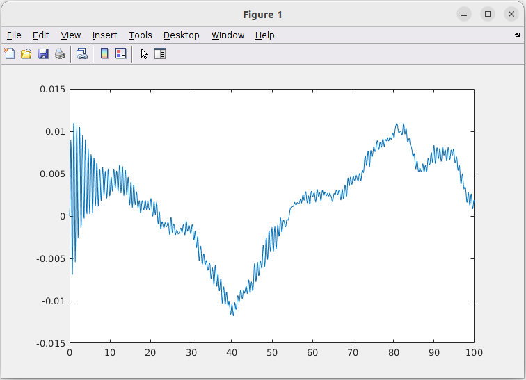

# Example of running Suspension 3DoF demo on Databricks

This demo contains a MATLAB function that can run a modified version of the
`sldemo_suspn_3dof` Simulink demo.

This example requires the following toolboxes:

* MATLAB&reg; Compiler&trade;
* Simulink&reg; Compiler&trade; & supported C++ compiler
* MATLAB&reg; Compiler SDK&trade;
* A Python&reg; environment to support building a .whl build and Databricks&reg; Connect

Use the `ver` command to check for their presence.

> **Note:** As this example uses the Simulink Compiler, the output is **not**
> cross-platform. Databricks nodes runs on Linux&reg; only, thus this example must be
> compiled on a Linux system.

This modified model, `sldemo_suspn_3dof_with_input`, takes different road surface
profiles as an input rather than via a block where the user chooses one.
This makes it possible to programmatically run simulations for different road
profiles. The function `runModel_spark_with_input.m` does exactly this, taking
a table as an input, and returning a table as an output.

> To work with this example locally independently of the Databricks functionality
> use `openExample("sldemo_suspn_3dof")`.

## Step 1 - Create and upload input data

Begin by copying the example to a temporary working directory:

```matlab
workDir = fullfile(tempdir, "SimulinkSuspension3DoF");
copyfile(databricksRoot("examples", "SimulinkSuspension3DoF"), workDir)
cd(workDir)
```

In order to run on a cluster, the input data for the simulations must be available
on the cluster. The original data is in `sldemo_suspn_3dof_sigData.mat`.
It can be converted into `parquet` files using the function `createDatasets`.
This will create 20 `parquet` files in the subfolder `data`, `Road1.parquet`,
`Road2.parquet`, etc. Parquet is a common file type used when working with tabular
data in Spark&trade; and are also supported by MATLAB.

The function `uploadDatasets` will upload these to Databricks, a customized
destination directory must be provided.

```matlab
createDataSets
T = parquetread("data/Road1.parquet")
uploadDatasets("/Volumes/main/default/myvolume/Examples/SimulinkSuspension3DoF/data")
```

## Step 2 - Build a Python Wheel file

The function `buildLibrary.m` will build a Python Wheel (`.whl`) file, that can
be used on a *Dedicated compute* mode Databricks cluster with the MATLAB runtime
installed.

The steps involved are as follows:

```matlab
% Load the Simulink model
load_system("sldemo_suspn_3dof_with_input");

% Use a sample RoadN table and a vehicle mass of 1400kg
Road1 = parquetread(fullfile(pwd, "data", "Road1.parquet"));

% Generates the Schema for this function.
generateFunctionSchema("runModel_spark_with_input", {Road1, 1400});
```

Create a build options object to track:

* The MATLAB function name: `runModel_spark_with_input.m`
* The output directory: `_build`
* The resulting Python package name: `demo.suspn3dof_with_input`

```matlab
buildOpts = compiler.build.PythonPackageOptions(...
    'runModel_spark_with_input.m', ...
    'OutputDir', '_build', ...
    'PackageName', 'demo.suspn3dof_with_input');
```

Build the `.whl` file:

```matlab
PSB = compiler.build.spark.pythonPackage(buildOpts);

PSB =
  PythonSparkBuilder with properties:

       BuildResults: [1x1 compiler.build.Results]
          BuildOpts: [1x1 compiler.build.PythonPackageOptions]
            PkgName: "demo.suspn3dof_with_input"
          PkgFolder: []
          OutputDir: '/tmp/SimulinkSuspension3DoF/_build'
             SrcDir: "/tmp/SimulinkSuspension3DoF/_build/demo/suspn3dof_with_input"
              Files: [1x1 compiler.build.spark.PythonFileV2]
       GenMatlabDir: "/tmp/SimulinkSuspension3DoF/_build/matlab_helpers"
        HelperFiles: [1x2 string]
       ExampleFiles: [1x2 table]
    ZipArtifactName: "/tmp/SimulinkSuspension3DoF/_build/demo.suspn3dof_with_input_Artifact.zip"
```

## Step 3 - Move the resulting .whl file to the cluster

Different versions of the Databricks runtime support different path type for storing
libraries, for details see: [https://docs.databricks.com/aws/en/libraries](https://docs.databricks.com/aws/en/libraries/)

There are several approaches to moving the wheel file to Databricks. For one of
testing use cases method 3.1 is recommended of scripted workflows method 3.2 is
recommended.

> If running MATLAB on Databricks directly `copyfile/movefile` can be used to move the wheel file to the desired location.

### 3.1 Copy the resulting `.whl` file manually

Use the Databricks portal/GUI to manually drag and drop the `.whl` file to a given
destination. The `.whl` can then be "installed" in a notebook using the `%pip install <packagename>`
command at start of the notebook.

### 3.2 Copy the resulting `.whl` file to Databricks

This uploads the .whl to the destination directory, int his case using a `databricks.Files`
object to address a "/Volumes" path.

```matlab
f = databricks.Files;
[wheelFilePath, wheelFileName] = PSB.getWheelFile;
tf = f.upload(wheelFilePath, "/Volumes/main/default/myvolume/Examples/SimulinkSuspension3DoF/" + string(wheelFileName));
assert(tf, "Wheel file upload failed.");
```

Again the `.whl` can then be "installed" in a notebook using the `%pip install <packagename>`
command at start of the notebook.

### 3.3 Automatically upload the `.whl` and install it as a Library

This approach copies the file to a destination in a path type agnostic way and
then attempts to install the `.whl` as a library via the Libraries API on the
user's default cluster if configured or on an optionally specified cluster.

> Installing a Library via the Libraries API requires an Allow Lists entry which
> end users typically do not have sufficient privileges to set. Also updating the
> library to a new version requires a restart of the cluster.

```matlab
PSB.installWheelOnDatabricksCluster("/Volumes/main/default/myvolume/Examples/SimulinkSuspension3DoF")
```

> If using this approach the cluster creation process in step 4 must first be completed
> or the library will be installed on the existing default cluster.
> In general the %pip install approach is preferred as it allows for more flexibility.

## Step 4 - Running the model on Databricks

To run `.whl` model a cluster which has the MATLAB runtime installed, must be available.
The MATLAB runtime version must match that of the MATLAB used to build the `.whl`.
The following will create a cluster and make it the default for later operations.

```matlab
c = createDatabricksCluster("3DOF", 2, updateClusterId=true);
```

The simulations will be run from a notebook attached to the cluster.
`3DoF-Profiles.py` is a sample notebook to run the simulations in parallel.
It can be imported into a Databricks workspace using the &vellip; `Import`
feature in the Databricks GUI or programmatically via `databricks.Workspace`.

```matlab
ws = databricks.Workspace();
notebookPath = "/Workspace/Users/" + string(ws.username) + "/Examples/" + "3DoF-Profiles.py";
ws.import('path', notebookPath, 'format', 'SOURCE', 'language', 'PYTHON', ...
        'file', fullfile(workDir, "3DoF-Profiles.py"), 'overwrite', true);
```

Once imported updated the paths inline with those used previously. Make sure to
connect the notebook to the appropriate cluster, it will likely default to serverless
which cannot be used in this scenario.

Step through the cells of the notebook.

## Step 5 - Reviewing results

The final cell presents a tabular view of a subset of the results. There are many
approaches one might take next. The following trivial sanity check of the results
uses MATLAB to plot some of the results.

Create a Spark session, in this case, connected to the cluster used to run the notebook.
Consider first calling `updateClusterId()` to use the cluster used for the notebook.

```matlab
spark = getDatabricksSession()
spark = 
  PySparkSession with properties:

         ClusterId: "0417-080746-8oy4uhkz"
    RuntimeVersion: "17.3"
        Serverless: "false"
```

```matlab
% Take the outname value generated by the notebook
outName = "/Volumes/main/default/myvolume/Examples/SimulinkSuspension3DoF/output_20250716_180325";
```

The following code, creates an output Dataframe called `RESULTS`, form this the
Road 7 data is filtered, to a Dataframe `Road7`. These Dataframes "really" exist
on the cluster not as MATLAB workspace variables. The `table()` call converts the
Dataframe to a true MATLAB table in the MATLAB workspace. Plot simply plot 2
columns of data, showing how the resulting data can be consumed by a conventional
MATLAB function.

```matlab
RESULTS = spark.read.format("delta").load(outName);
Road7 = RESULTS.filter("ID LIKE 'Road7'");
T = table(Road7);
head(T)
plot(T.Time, T.VerticalDisplacement)
```

The result should resemble this plot:



This example uses `applyInPandas(runModel_spark_with_input_pandas(1400), runModel_spark_with_input_output_schema)`
to achieve parallelism. As an alternative `mapPartitions` could be used.
Sample notebooks for both can be found in the `_build/examples` directory.
These are dynamically generated a build time.

## MATLAB Parallel Server alternative approach

> An alternative way to simulate this in parallel is by using MATLAB&reg; Parallel Server&trade;.
> The shipping demo `sldemo_parsim_paramsweep_suspn.m` does exactly this. Please
> refer to this file for additional information.
> See also [parsim](https://www.mathworks.com/help/simulink/slref/parsim.html).

## Clean up

Once done remember to cleanup the temporary directories created and terminate or
delete the cluster if no longer needed.

[//]: #  (Copyright 2021-2026 The MathWorks, Inc.)
